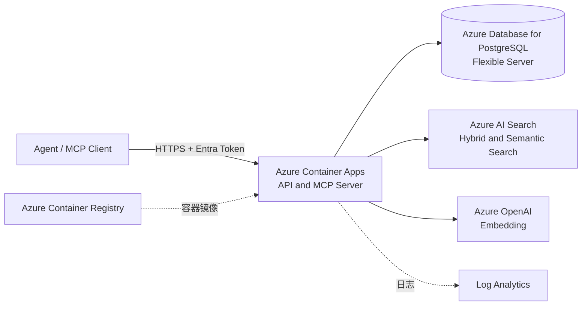
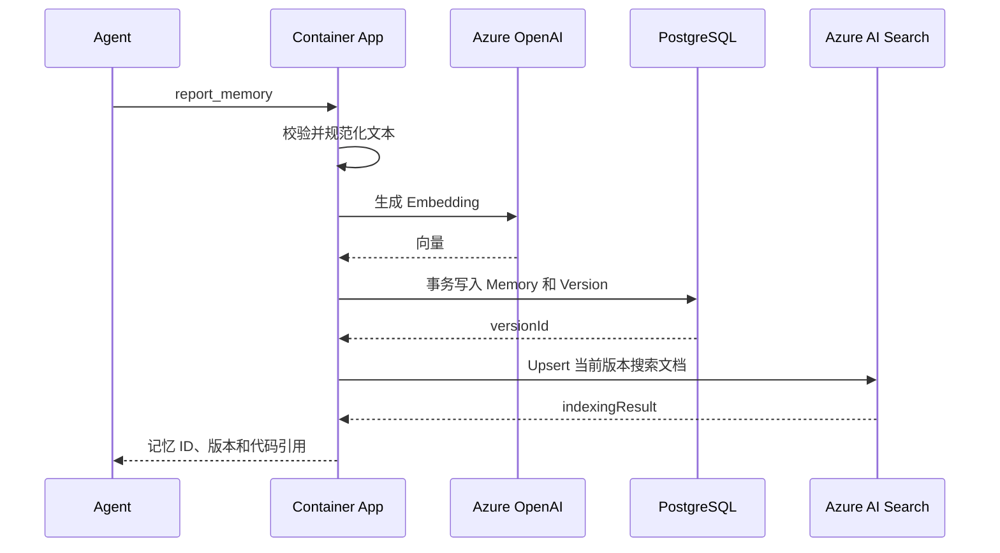

# FactLineage Azure 三天 MVP 设计

本文只描述 3 天内可以完成的最小系统。目标是跑通“Agent 写入项目记忆、Agent 查询记忆、返回代码引用”闭环，不提前建设生产级平台能力。

## MVP 范围

### 必须完成

- Agent 报告功能、接口参数、实现文件和代码符号。
- 系统保存不可变的记忆版本及代码引用。
- Agent 使用自然语言和项目过滤条件查询记忆。
- 查询同时使用关键词和向量相似度，并返回来源。
- Agent 可以对指定记忆版本标记有用或无用，并提供结构化质量原因。
- 提供 HTTP API 和最小 MCP Server。
- 部署到一个 Azure 区域，可从本地 Agent 调用。

### 三天内不做

- 自动监听 GitHub 或 Azure DevOps 变更。
- 自动判断记忆过期、冲突合并和调用链分析。
- 多租户计费、复杂 RBAC 和管理后台。
- 消息队列和异步索引管道。
- 私网、WAF、多区域、灾备和自动扩缩容调优。
- Redis 缓存、对象存储、内容安全扫描和高级审计。
- 基于反馈的排序、根据投票自动修改记忆或自动删除记忆。

## 最小 Azure 架构



整个应用使用一个容器、一个 PostgreSQL 数据库和一个 Azure AI Search 索引。PostgreSQL 是记忆与版本的事实来源，Azure AI Search 只保存当前版本的可检索投影。HTTP API、MCP 工具、参数校验、Embedding 调用和索引同步都在同一个进程中完成。

## 只保留的 Azure 服务

| Azure 服务 | 用途 | 必要性 |
| --- | --- | --- |
| Azure Container Apps | 运行 HTTP API 和 MCP Server | 唯一应用计算服务，部署简单且自带 HTTPS |
| Azure Database for PostgreSQL Flexible Server | 保存记忆、版本和代码引用 | 作为不可变版本及业务数据的事实来源 |
| Azure AI Search | 关键词、向量混合检索及语义重排 | 提供托管索引和语义搜索，减少自建检索逻辑 |
| Azure OpenAI | 生成查询和记忆的 Embedding | 支持自然语言语义检索 |
| Azure Container Registry | 保存应用镜像 | 供 Container Apps 拉取部署镜像 |
| Log Analytics | 查看 Container Apps 日志 | 用于三天内排错和基本运行检查 |

不单独部署 Key Vault，因为服务不保存 Azure Access Key 或数据库密码。Azure OpenAI、Azure AI Search、PostgreSQL 和 ACR 均通过 Container Apps 用户分配托管标识访问。

## 删除的服务

| 删除项 | MVP 替代方案 | 以后何时引入 |
| --- | --- | --- |
| Azure Front Door | 直接使用 Container Apps HTTPS 地址 | 需要 WAF、全球入口或多区域路由时 |
| API Management | 应用内 Entra Token 校验和版本路由 | 需要外部开发者、配额或复杂 API 治理时 |
| Azure Service Bus | 请求内同步写入和生成 Embedding | 写入量导致超时或需要可靠异步任务时 |
| Azure Event Grid | 暂不接收仓库事件 | 开始自动检测代码变更时 |
| Azure Blob Storage | 小型报告和代码引用直接存 JSONB | 需要保存源码快照或大型附件时 |
| Azure Managed Redis | 不做缓存 | PostgreSQL 或模型调用成为热点时 |
| Azure Key Vault | Container Apps Secret | 进入正式生产或需要自动轮换时 |
| App Configuration | 使用环境变量 | 需要动态配置和 Feature Flag 时 |
| Content Safety | 限制为可信项目内部使用 | 接收不可信公网内容时 |
| Private Link / Azure Firewall | 使用服务防火墙和 TLS | 进入企业生产网络时 |
| 多区域部署 | 单区域 | 有明确 SLA、RPO 和 RTO 后 |

## 应用结构

一个服务包含四个小模块，不拆微服务：

```text
aidoc-server
  api        HTTP 路由、认证和参数校验
  mcp        MCP 工具定义，直接调用相同业务函数
  memory     记忆写入、版本读取和项目过滤
  search     Embedding、Azure AI Search 索引同步和混合查询
```

HTTP 与 MCP 共用业务层，避免两套实现出现差异。服务保持无状态，所有权威业务数据都在 PostgreSQL 中，Azure AI Search 索引可随时重建。

## 最小数据模型

### projects

| 字段 | 类型 | 说明 |
| --- | --- | --- |
| `id` | UUID | 项目标识 |
| `name` | TEXT | 项目名称 |
| `repository_url` | TEXT | 仓库地址 |
| `created_at` | TIMESTAMPTZ | 创建时间 |

### memories

| 字段 | 类型 | 说明 |
| --- | --- | --- |
| `id` | UUID | 记忆标识 |
| `project_id` | UUID | 所属项目 |
| `type` | TEXT | `feature`、`api` 或 `decision` |
| `title` | TEXT | 标题 |
| `current_version` | INTEGER | 当前版本号 |
| `created_at` | TIMESTAMPTZ | 创建时间 |

### memory_versions

| 字段 | 类型 | 说明 |
| --- | --- | --- |
| `id` | UUID | 版本标识 |
| `memory_id` | UUID | 所属记忆 |
| `version` | INTEGER | 递增版本号 |
| `summary` | TEXT | 功能或接口说明 |
| `details` | JSONB | 参数、返回值及补充结构化信息 |
| `code_references` | JSONB | 提交、文件、符号和行号 |
| `content_text` | TEXT | 用于重建搜索索引和生成 Embedding 的规范化文本 |
| `created_by` | TEXT | Agent 显示名称；保留为向后兼容的存储列 |
| `actor_id` | TEXT NULL | 可信 Entra `tid:oid`/`tid:sub`；仅在可信审计上线前的历史版本中为 null |
| `created_at` | TIMESTAMPTZ | 创建时间 |

写入请求优先使用 `agentName`；旧 `createdBy` 作为同一非可信显示名称的兼容别名。服务忽略请求中的 `actorId`，只从已验证 Entra claim 派生。读取响应同时返回 `agentName`、旧 `createdBy` 别名和可信 `actorId`。

### memory_feedback

反馈绑定到不可变的记忆版本，而不是会变化的记忆当前版本指针。

| 字段 | 类型 | 说明 |
| --- | --- | --- |
| `id` | UUID | 反馈标识 |
| `memory_version_id` | UUID | 被评价的版本 |
| `actor_id` | TEXT | Entra `oid` 或稳定调用方主体 |
| `sentiment` | TEXT | `useful` 或 `not_useful` |
| `reason` | TEXT | `useful`、`incorrect`、`stale`、`irrelevant` 或 `missing_evidence` |
| `comment` | TEXT NULL | 可选的简短纠正说明或上下文 |
| `search_query` | TEXT NULL | 可选的结果来源查询；敏感时省略 |
| `created_at` | TIMESTAMPTZ | 首次提交时间 |
| `updated_at` | TIMESTAMPTZ | 最后替换时间 |

建立 `memory_feedback(memory_version_id, actor_id)` 唯一索引。同一调用方对同一版本再次提交时替换自己的当前反馈，不累计多票；删除反馈只移除该调用方的记录。

PostgreSQL 只建立业务查询需要的索引：

- `memories(project_id, type)` B-tree 索引。
- `memory_versions(memory_id, version)` 唯一索引。
- `memory_feedback(memory_version_id, actor_id)` 唯一索引。

### Azure AI Search 索引

只索引每条记忆的当前版本，最小字段如下：

| 字段 | 类型 | 属性 |
| --- | --- | --- |
| `memoryId` | `Edm.String` | key、filterable |
| `projectId` | `Edm.String` | filterable |
| `type` | `Edm.String` | filterable、facetable |
| `version` | `Edm.Int32` | filterable、sortable |
| `title` | `Edm.String` | searchable，语义标题字段 |
| `summary` | `Edm.String` | searchable，语义内容字段 |
| `contentText` | `Edm.String` | searchable，语义内容字段 |
| `embedding` | `Collection(Edm.Single)` | searchable，HNSW 向量字段 |

代码引用仍以 PostgreSQL 为准，不在搜索索引中维护第二份完整副本。搜索返回 `memoryId` 后，应用批量读取 PostgreSQL 当前版本并组装响应。

## API 与 MCP

### HTTP API

| 操作 | 接口 | 说明 |
| --- | --- | --- |
| 健康检查 | `GET /health` | 检查应用进程，不调用模型 |
| 创建项目 | `POST /v1/projects` | 创建最小项目记录 |
| 列出项目 | `GET /v1/projects` | 返回项目及其标识 |
| 写入记忆 | `POST /v1/projects/{projectId}/memories` | 创建记忆及第一个版本 |
| 修订记忆 | `POST /v1/memories/{memoryId}/versions` | 追加不可变版本 |
| 获取记忆 | `GET /v1/memories/{memoryId}` | 返回当前版本及代码引用 |
| 查询记忆 | `POST /v1/projects/{projectId}/search` | 返回 Azure AI Search 混合及语义检索结果 |
| 提交或替换反馈 | `PUT /v1/memories/{memoryId}/versions/{version}/feedback` | 保存调用方对指定版本的质量信号 |
| 删除反馈 | `DELETE /v1/memories/{memoryId}/versions/{version}/feedback` | 删除调用方的当前反馈 |
| 获取反馈摘要 | `GET /v1/memories/{memoryId}/versions/{version}/feedback-summary` | 返回聚合计数、原因和复核状态 |

### MCP 工具

实现七个工具：

- `create_project`：创建用于限定记忆和查询范围的项目。
- `list_projects`：列出项目及其标识。
- `report_memory`：创建或修订功能、接口或决策记忆。
- `search_memories`：按项目查询相关记忆。
- `get_memory`：读取指定记忆的当前版本和引用。
- `submit_memory_feedback`：提交或替换调用方对指定版本的反馈。
- `get_memory_feedback_summary`：读取指定版本的聚合质量信号和复核状态。

MCP 工具不接受 actor identity 参数。服务从已验证的 Entra Token 派生调用方身份，避免一个 Agent 代替另一个 Agent 投票。

## 写入流程



为了保持实现简单，写入同步生成 Embedding 并更新搜索索引。Azure OpenAI 调用失败时仍保存记忆，并将不含向量的文档写入 Azure AI Search，使其仍可通过关键词查询。Azure AI Search 更新失败时不回滚 PostgreSQL 事务，响应返回 `indexingStatus: pending` 并记录错误。提供一个受 Entra 保护的 `POST /internal/reindex` 接口，从 PostgreSQL 当前版本重建或补齐索引，不引入队列和后台任务。

## 查询流程

1. 校验 Entra Token 和 `projectId`。
2. 调用 Azure OpenAI 生成查询向量；失败时降级为关键词查询。
3. 向 Azure AI Search 发送文本查询、向量查询以及 `projectId` 和可选 `type` 过滤条件。
4. Azure AI Search 使用 BM25 和向量检索召回候选，通过 Reciprocal Rank Fusion 合并，再使用 Semantic Ranker 重排。
5. 应用按搜索结果中的 `memoryId` 批量读取 PostgreSQL，返回前 10 条记忆的摘要、版本和代码引用。
6. 应用从 PostgreSQL 附加每个返回版本的反馈摘要和 `needsReview` 警告。

向量查询使用余弦相似度并取最多 50 个近邻。语义配置将 `title` 设为标题字段，将 `summary` 和 `contentText` 设为内容字段。MVP 使用 Azure AI Search 原生混合排序，不在应用内维护另一套固定权重公式：

- 有查询向量时，使用文本、向量和语义重排。
- 查询 Embedding 失败时，只使用文本和语义重排。
- Semantic Ranker 请求失败时，应用重试不带语义重排的 BM25 与向量混合查询。
- 不返回 semantic answers，只返回已保存的记忆摘要和代码引用，避免生成未持久化的答案。

三天内不增加自定义模型重排、时间衰减或反馈学习。

## 反馈与质量复核

界面可以显示点赞和踩，但存储与 Agent 契约使用结构化语义：

- 点赞映射为 `sentiment: useful` 和 `reason: useful`。
- 踩映射为 `sentiment: not_useful`，且必须选择 `incorrect`、`stale`、`irrelevant` 或 `missing_evidence`。
- 只要当前反馈中至少有一条 `incorrect`、`stale` 或 `missing_evidence`，版本摘要的 `needsReview` 就为 `true`。
- `irrelevant` 描述该查询下的检索质量，本身不表示记忆内容错误。
- comment 可以提出纠正建议，但反馈不能修改记忆正文或代码引用。

反馈摘要包含 `usefulCount`、`notUsefulCount`、各原因计数和 `needsReview`。查询和读取记忆时都返回该摘要，使 Agent 将被标记的记忆视为可疑内容，在使用前重新核对证据。

初始排序仍使用 BM25、向量检索、Reciprocal Rank Fusion 和 Semantic Ranker。在反馈量、抗滥用机制、离线评估和版本级质量模型成熟前，不要用投票数乘以排序分数，避免少量反馈隐藏正确的项目事实。

## 最小安全设计

- Container Apps 只开放 HTTPS ingress。
- 所有业务接口要求面向配置 API audience 的 Microsoft Entra Bearer Token。
- 服务从已验证 Token claim 派生反馈 actor identity，不接受请求传入该身份。
- Container Apps 使用用户分配托管标识调用 PostgreSQL、Azure OpenAI、Azure AI Search 和拉取 ACR 镜像。
- PostgreSQL 只允许 Azure 服务和开发者当前出口 IP，并强制 TLS。
- 默认只保存代码位置和摘要，不保存完整源码。
- 日志不记录 Bearer Token、带凭据的连接字符串或完整记忆正文。
- 日志不记录反馈 comment 或 search query；确有运维需要时只记录反馈原因、版本 ID 和处理结果。

Entra App Registration 为交互式 Agent 暴露 `access_as_user` delegated scope。Azure 工作负载调用方使用自己的 Entra identity；FactLineage 服务不需要 Client Secret。

## 配置

应用只需要以下环境变量：

| 变量 | 说明 |
| --- | --- |
| `Cloud__ManagedIdentityClientId` | 用户分配托管标识 Client ID |
| `Cloud__TenantId` | 用于 Token 校验的 Entra Tenant ID |
| `Cloud__ApiAudience` | FactLineage API Application ID URI |
| `Cloud__PostgreSql__Host` | PostgreSQL 主机；认证使用 Entra Token |
| `Cloud__PostgreSql__Database` | PostgreSQL 数据库名 |
| `Cloud__PostgreSql__User` | 托管标识主体名称 |
| `Cloud__Search__Endpoint` | Azure AI Search 端点 |
| `Cloud__Search__IndexName` | 记忆索引名称 |
| `Cloud__Search__SemanticConfigurationName` | 语义配置名称 |
| `Cloud__OpenAi__Endpoint` | Azure OpenAI 端点 |
| `Cloud__OpenAi__EmbeddingDeployment` | Embedding 部署名称 |
| `Cloud__OpenAi__EmbeddingDimensions` | 与 Search 向量字段一致的维度 |

## 三天实施计划

### 第一天：基础链路

- 创建 ACR、PostgreSQL、Azure OpenAI、Azure AI Search 和 Container Apps 环境。
- 建立项目、记忆和版本表，创建 Azure AI Search 混合向量索引及语义配置。
- 创建单体服务，实现 `/health`、项目创建和记忆写入。
- 本地完成数据库集成测试。

完成标准：可以通过 HTTP 写入一条带代码引用的记忆，并从 PostgreSQL 读回。

### 第二天：检索与 MCP

- 接入 Azure OpenAI Embedding。
- 实现 Azure AI Search 索引同步、关键词与向量混合查询和语义重排。
- 实现七个 MCP 工具，并复用 HTTP 业务层。
- 增加 Embedding 失败降级和人工重建索引接口。
- 实现版本级反馈提交、反馈摘要读取和 `needsReview` 警告，不改变排序。

完成标准：Agent 可以报告一个功能，并通过另一种自然语言表述查到它及其代码引用。

### 第三天：部署与验收

- 构建镜像并推送 ACR，部署到 Container Apps。
- 配置托管标识、Entra API Application、HTTPS ingress 和数据库防火墙。
- 增加 Entra 鉴权、结构化日志和最小错误处理。
- 运行端到端测试，补充调用示例和部署说明。

完成标准：本地 IDE Agent 能调用 Azure 上的 MCP Server；服务重启后记忆不丢失；Azure OpenAI 临时失败时关键词查询仍可用。

## 验收清单

- [ ] HTTP 和 MCP 使用同一套记忆写入与查询逻辑。
- [ ] 记忆修订创建新版本，不覆盖历史版本。
- [ ] 查询严格限定在指定项目中。
- [ ] 每个查询结果包含 `memoryId`、`version`、`summary` 和 `codeReferences`。
- [ ] Azure OpenAI 不可用时写入与关键词查询仍能工作。
- [ ] Azure AI Search 索引可以从 PostgreSQL 当前版本完整重建。
- [ ] 反馈绑定不可变版本，同一 actor 对同一版本最多只有一个当前反馈。
- [ ] 负面反馈必须提供结构化原因，且不能修改或删除记忆。
- [ ] 查询和读取结果返回反馈摘要与 `needsReview`，但不改变排序。
- [ ] Bearer Token、Access Key、Client Secret 和带凭据的连接字符串不会出现在仓库、镜像或日志中。
- [ ] Container Apps 中能够查看请求错误和检索耗时。

## 扩展触发条件

不要按时间预先增加服务，只在出现明确问题时扩展：

| 观察到的问题 | 下一步 |
| --- | --- |
| 写入经常因 Embedding 超时 | 引入 Service Bus 和独立 Worker |
| Azure AI Search 查询 P95 或容量接近上限 | 调整 SKU、分区数或副本数 |
| 需要自动处理提交事件 | 引入 Event Grid 和失效分析任务 |
| 需要存储大型源码快照 | 引入 Blob Storage |
| 多团队使用且权限不同 | 接入 Entra ID 和项目级 RBAC |
| 需要公网生产防护 | 引入 API Management、Front Door 和 WAF |
| 有明确跨区域 SLA | 设计第二地区和故障转移 |