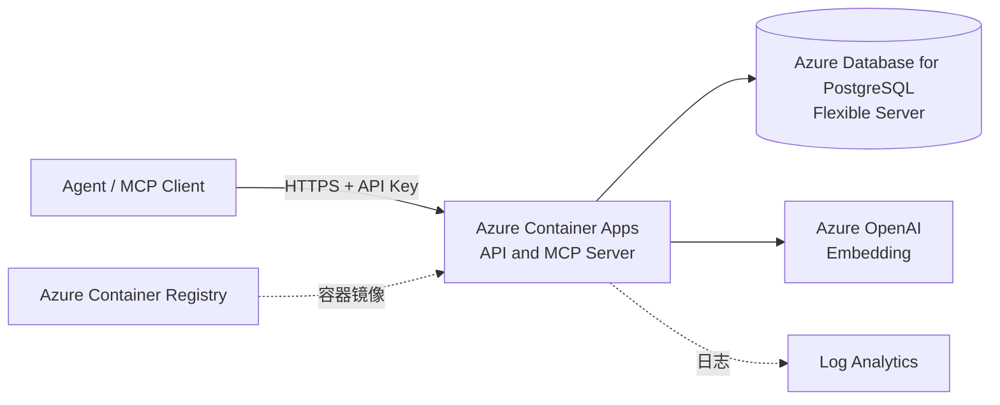
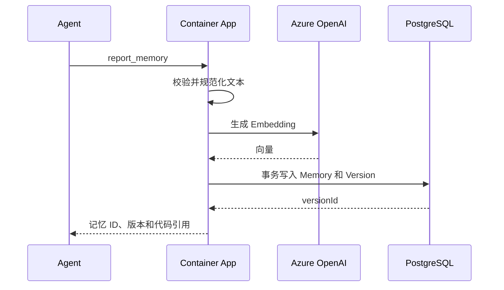

# AI Doc Azure 三天 MVP 设计

本文只描述 3 天内可以完成的最小系统。目标是跑通“Agent 写入项目记忆、Agent 查询记忆、返回代码引用”闭环，不提前建设生产级平台能力。

## MVP 范围

### 必须完成

- Agent 报告功能、接口参数、实现文件和代码符号。
- 系统保存不可变的记忆版本及代码引用。
- Agent 使用自然语言和项目过滤条件查询记忆。
- 查询同时使用关键词和向量相似度，并返回来源。
- 提供 HTTP API 和最小 MCP Server。
- 部署到一个 Azure 区域，可从本地 Agent 调用。

### 三天内不做

- 自动监听 GitHub 或 Azure DevOps 变更。
- 自动判断记忆过期、冲突合并和调用链分析。
- 多租户计费、复杂 RBAC 和管理后台。
- 消息队列、异步索引和独立搜索服务。
- 私网、WAF、多区域、灾备和自动扩缩容调优。
- Redis 缓存、对象存储、内容安全扫描和高级审计。

## 最小 Azure 架构



整个应用使用一个容器和一个 PostgreSQL 数据库。HTTP API、MCP 工具、参数校验、Embedding 调用和检索排序都在同一个进程中完成。

## 只保留的 Azure 服务

| Azure 服务 | 用途 | 必要性 |
| --- | --- | --- |
| Azure Container Apps | 运行 HTTP API 和 MCP Server | 唯一应用计算服务，部署简单且自带 HTTPS |
| Azure Database for PostgreSQL Flexible Server | 保存记忆、版本、代码引用及向量 | 同时承担事实存储和检索，避免引入 Azure AI Search |
| Azure OpenAI | 生成查询和记忆的 Embedding | 支持自然语言语义检索 |
| Azure Container Registry | 保存应用镜像 | 供 Container Apps 拉取部署镜像 |
| Log Analytics | 查看 Container Apps 日志 | 用于三天内排错和基本运行检查 |

不单独部署 Key Vault。数据库连接和 API Key 暂时保存在 Container Apps Secret 中；Azure OpenAI 优先通过 Container Apps 托管标识访问。

## 删除的服务

| 删除项 | MVP 替代方案 | 以后何时引入 |
| --- | --- | --- |
| Azure Front Door | 直接使用 Container Apps HTTPS 地址 | 需要 WAF、全球入口或多区域路由时 |
| API Management | 应用内 API Key 校验和版本路由 | 需要外部开发者、配额或复杂 API 治理时 |
| Azure Service Bus | 请求内同步写入和生成 Embedding | 写入量导致超时或需要可靠异步任务时 |
| Azure Event Grid | 暂不接收仓库事件 | 开始自动检测代码变更时 |
| Azure AI Search | PostgreSQL `pgvector` + `pg_trgm` | 数据量或查询并发超出 PostgreSQL 能力时 |
| Azure Blob Storage | 小型报告和代码引用直接存 JSONB | 需要保存源码快照或大型附件时 |
| Azure Managed Redis | 不做缓存 | PostgreSQL 或模型调用成为热点时 |
| Azure Key Vault | Container Apps Secret | 进入正式生产或需要自动轮换时 |
| App Configuration | 使用环境变量 | 需要动态配置和 Feature Flag 时 |
| Content Safety | 限制为可信项目内部使用 | 接收不可信公网内容时 |
| Private Link / Azure Firewall | 使用服务防火墙和 TLS | 进入企业生产网络时 |
| 多区域部署 | 单区域 | 有明确 SLA、RPO 和 RTO 后 |

## 应用结构

一个服务包含四个小模块，不拆微服务：

```text
aidoc-server
  api        HTTP 路由、认证和参数校验
  mcp        MCP 工具定义，直接调用相同业务函数
  memory     记忆写入、版本读取和项目过滤
  search     Embedding、关键词召回和结果排序
```

HTTP 与 MCP 共用业务层，避免两套实现出现差异。服务保持无状态，所有持久化内容都在 PostgreSQL 中。

## 最小数据模型

### projects

| 字段 | 类型 | 说明 |
| --- | --- | --- |
| `id` | UUID | 项目标识 |
| `name` | TEXT | 项目名称 |
| `repository_url` | TEXT | 仓库地址 |
| `created_at` | TIMESTAMPTZ | 创建时间 |

### memories

| 字段 | 类型 | 说明 |
| --- | --- | --- |
| `id` | UUID | 记忆标识 |
| `project_id` | UUID | 所属项目 |
| `type` | TEXT | `feature`、`api` 或 `decision` |
| `title` | TEXT | 标题 |
| `current_version` | INTEGER | 当前版本号 |
| `created_at` | TIMESTAMPTZ | 创建时间 |

### memory_versions

| 字段 | 类型 | 说明 |
| --- | --- | --- |
| `id` | UUID | 版本标识 |
| `memory_id` | UUID | 所属记忆 |
| `version` | INTEGER | 递增版本号 |
| `summary` | TEXT | 功能或接口说明 |
| `details` | JSONB | 参数、返回值及补充结构化信息 |
| `code_references` | JSONB | 提交、文件、符号和行号 |
| `content_text` | TEXT | 用于关键词和 Embedding 的规范化文本 |
| `embedding` | VECTOR | Azure OpenAI 生成的向量 |
| `created_by` | TEXT | Agent 或用户标识 |
| `created_at` | TIMESTAMPTZ | 创建时间 |

启用 PostgreSQL 的 `vector` 和 `pg_trgm` 扩展。建立以下索引：

- `memories(project_id, type)` B-tree 索引。
- `memory_versions(memory_id, version)` 唯一索引。
- `content_text` 的 GIN trigram 索引。
- `embedding` 的 HNSW 向量索引；数据很少时可以先不创建。

## API 与 MCP

### HTTP API

| 操作 | 接口 | 说明 |
| --- | --- | --- |
| 健康检查 | `GET /health` | 检查应用进程，不调用模型 |
| 创建项目 | `POST /v1/projects` | 创建最小项目记录 |
| 写入记忆 | `POST /v1/projects/{projectId}/memories` | 创建记忆及第一个版本 |
| 修订记忆 | `POST /v1/memories/{memoryId}/versions` | 追加不可变版本 |
| 获取记忆 | `GET /v1/memories/{memoryId}` | 返回当前版本及代码引用 |
| 查询记忆 | `POST /v1/projects/{projectId}/search` | 返回混合检索结果 |

### MCP 工具

只实现三个工具：

- `report_memory`：创建或修订功能、接口或决策记忆。
- `search_memories`：按项目查询相关记忆。
- `get_memory`：读取指定记忆的当前版本和引用。

## 写入流程



为了保持实现简单，写入同步生成 Embedding。Azure OpenAI 调用失败时仍保存记忆，`embedding` 设为 `NULL`；该记忆仍可通过关键词查询。提供一个受 API Key 保护的 `POST /internal/backfill-embeddings` 接口，人工触发缺失向量补齐，不引入队列和后台任务。

## 查询流程

1. 校验 API Key 和 `projectId`。
2. 调用 Azure OpenAI 生成查询向量；失败时降级为关键词查询。
3. 在 PostgreSQL 中分别查询 trigram 相似度和向量距离。
4. 在应用内按固定权重合并并去重结果。
5. 返回前 10 条记忆的摘要、版本和代码引用。

MVP 排序可使用简单公式：

$$
score = 0.4 \times keywordScore + 0.6 \times vectorScore
$$

没有向量的记录只计算关键词分数。三天内不增加模型重排、时间衰减或反馈学习。

## 最小安全设计

- Container Apps 只开放 HTTPS ingress。
- 所有业务接口要求 `Authorization: Bearer <api-key>`。
- API Key、数据库连接字符串保存在 Container Apps Secret，禁止写入镜像和日志。
- Container Apps 使用托管标识调用 Azure OpenAI 和拉取 ACR 镜像。
- PostgreSQL 只允许 Azure 服务和开发者当前出口 IP，并强制 TLS。
- 默认只保存代码位置和摘要，不保存完整源码。
- 日志不记录 API Key、数据库连接字符串或完整记忆正文。

API Key 方案只适用于单团队 MVP。进入生产前应替换为 Microsoft Entra ID。

## 配置

应用只需要以下环境变量：

| 变量 | 说明 |
| --- | --- |
| `DATABASE_URL` | PostgreSQL TLS 连接字符串，来自 Container Apps Secret |
| `API_KEY` | MVP 调用密钥，来自 Container Apps Secret |
| `AZURE_OPENAI_ENDPOINT` | Azure OpenAI 端点 |
| `AZURE_OPENAI_EMBEDDING_DEPLOYMENT` | Embedding 部署名称 |
| `EMBEDDING_DIMENSIONS` | 向量维度，必须与 PostgreSQL 列一致 |
| `LOG_LEVEL` | 默认 `INFO` |

## 三天实施计划

### 第一天：基础链路

- 创建 ACR、PostgreSQL、Azure OpenAI 和 Container Apps 环境。
- 建立项目、记忆和版本表，启用 `vector` 与 `pg_trgm`。
- 创建单体服务，实现 `/health`、项目创建和记忆写入。
- 本地完成数据库集成测试。

完成标准：可以通过 HTTP 写入一条带代码引用的记忆，并从 PostgreSQL 读回。

### 第二天：检索与 MCP

- 接入 Azure OpenAI Embedding。
- 实现关键词、向量和混合查询。
- 实现三个 MCP 工具，并复用 HTTP 业务层。
- 增加 Embedding 失败降级和人工补齐接口。

完成标准：Agent 可以报告一个功能，并通过另一种自然语言表述查到它及其代码引用。

### 第三天：部署与验收

- 构建镜像并推送 ACR，部署到 Container Apps。
- 配置托管标识、Secret、HTTPS ingress 和数据库防火墙。
- 增加 API Key 鉴权、结构化日志和最小错误处理。
- 运行端到端测试，补充调用示例和部署说明。

完成标准：本地 IDE Agent 能调用 Azure 上的 MCP Server；服务重启后记忆不丢失；Azure OpenAI 临时失败时关键词查询仍可用。

## 验收清单

- [ ] HTTP 和 MCP 使用同一套记忆写入与查询逻辑。
- [ ] 记忆修订创建新版本，不覆盖历史版本。
- [ ] 查询严格限定在指定项目中。
- [ ] 每个查询结果包含 `memoryId`、`version`、`summary` 和 `codeReferences`。
- [ ] Azure OpenAI 不可用时写入与关键词查询仍能工作。
- [ ] API Key 和连接字符串不会出现在仓库、镜像或日志中。
- [ ] Container Apps 中能够查看请求错误和检索耗时。

## 扩展触发条件

不要按时间预先增加服务，只在出现明确问题时扩展：

| 观察到的问题 | 下一步 |
| --- | --- |
| 写入经常因 Embedding 超时 | 引入 Service Bus 和独立 Worker |
| PostgreSQL 检索 P95 超过 2 秒 | 评估 Azure AI Search |
| 需要自动处理提交事件 | 引入 Event Grid 和失效分析任务 |
| 需要存储大型源码快照 | 引入 Blob Storage |
| 多团队使用且权限不同 | 接入 Entra ID 和项目级 RBAC |
| 需要公网生产防护 | 引入 API Management、Front Door 和 WAF |
| 有明确跨区域 SLA | 设计第二地区和故障转移 |