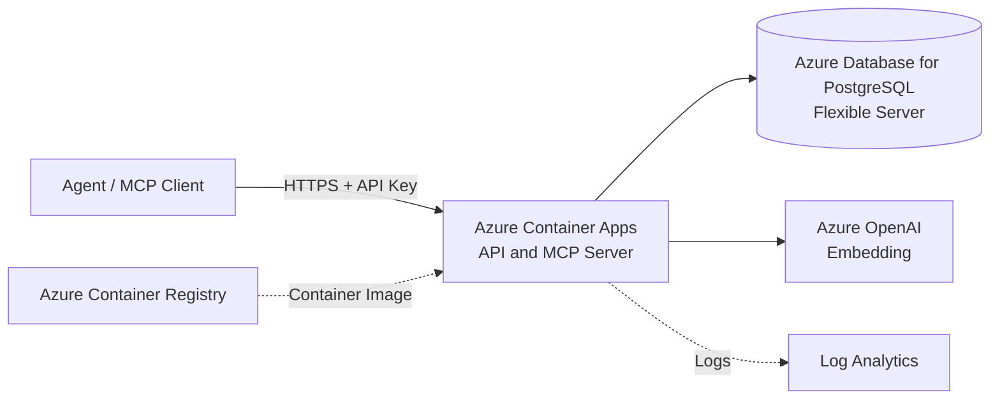
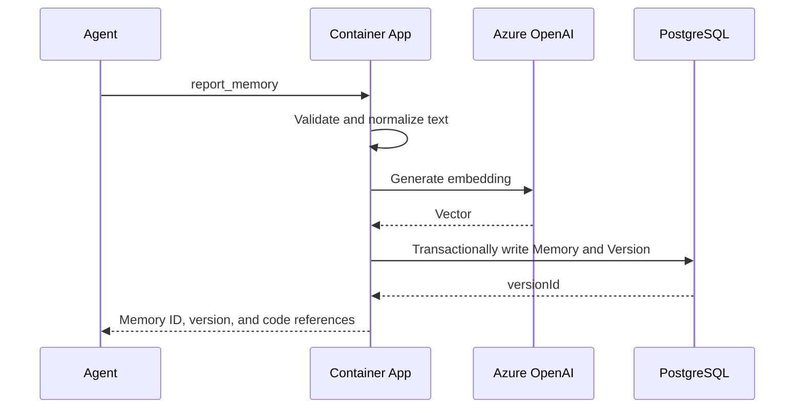

# AI Doc Azure Three-Day MVP Design

This document describes only the smallest system that can be completed within three days. The goal is to complete the core workflow in which an agent writes project memories, queries those memories, and receives code references, without building production-grade platform capabilities prematurely.

## MVP Scope

### Must Deliver

- Agents can report features, API parameters, implementation files, and code symbols.
- The system stores immutable memory versions and code references.
- Agents can query memories using natural language and project filters.
- Queries use both keyword and vector similarity and return sources.
- The system provides an HTTP API and a minimal MCP Server.
- The system is deployed to one Azure region and can be called by local agents.

### Out of Scope for Three Days

- Automatically monitoring GitHub or Azure DevOps changes.
- Automatically detecting stale memories, merging conflicts, or analyzing call chains.
- Multi-tenant billing, complex RBAC, or an administration portal.
- Message queues, asynchronous indexing, or a separate search service.
- Private networking, WAF, multiple regions, disaster recovery, or autoscaling optimization.
- Redis caching, object storage, content safety scanning, or advanced auditing.

## Minimal Azure Architecture



The entire application uses one container and one PostgreSQL database. The HTTP API, MCP tools, parameter validation, embedding calls, and retrieval ranking all run in the same process.

## Azure Services Retained

| Azure Service | Purpose | Why It Is Required |
| --- | --- | --- |
| Azure Container Apps | Run the HTTP API and MCP Server | The only application compute service; simple deployment with built-in HTTPS |
| Azure Database for PostgreSQL Flexible Server | Store memories, versions, code references, and vectors | Handles both system-of-record storage and retrieval, avoiding the need for Azure AI Search |
| Azure OpenAI | Generate embeddings for queries and memories | Enables natural-language semantic retrieval |
| Azure Container Registry | Store the application image | Supplies the deployment image to Container Apps |
| Log Analytics | View Container Apps logs | Supports troubleshooting and basic operational checks during the three-day implementation |

Key Vault is not deployed separately. The database connection and API key are temporarily stored in Container Apps secrets. Azure OpenAI should preferably be accessed through the Container Apps managed identity.

## Services Removed

| Removed Service | MVP Alternative | When to Introduce It Later |
| --- | --- | --- |
| Azure Front Door | Use the Container Apps HTTPS endpoint directly | When WAF, a global endpoint, or multi-region routing is required |
| API Management | Validate API keys and route versions within the application | When external developers, quotas, or complex API governance are required |
| Azure Service Bus | Write data and generate embeddings synchronously within the request | When write volume causes timeouts or reliable asynchronous processing is required |
| Azure Event Grid | Do not receive repository events yet | When automatic code change detection begins |
| Azure AI Search | PostgreSQL `pgvector` + `pg_trgm` | When data volume or query concurrency exceeds PostgreSQL capabilities |
| Azure Blob Storage | Store small reports and code references directly in JSONB | When source snapshots or large attachments must be stored |
| Azure Managed Redis | Do not use a cache | When PostgreSQL or model calls become a bottleneck |
| Azure Key Vault | Container Apps secrets | When moving to production or requiring automatic secret rotation |
| App Configuration | Environment variables | When dynamic configuration and feature flags are required |
| Content Safety | Restrict usage to trusted internal projects | When accepting untrusted public content |
| Private Link / Azure Firewall | Service firewalls and TLS | When entering an enterprise production network |
| Multi-region deployment | One region | When explicit SLA, RPO, and RTO requirements exist |

## Application Structure

One service contains four small modules and is not split into microservices:

```text
aidoc-server
  api        HTTP routing, authentication, and parameter validation
  mcp        MCP tool definitions that call the same business functions directly
  memory     Memory writes, version reads, and project filtering
  search     Embeddings, keyword retrieval, and result ranking
```

HTTP and MCP share the business layer to avoid differences between two implementations. The service remains stateless, and all persistent data is stored in PostgreSQL.

## Minimal Data Model

### projects

| Field | Type | Description |
| --- | --- | --- |
| `id` | UUID | Project identifier |
| `name` | TEXT | Project name |
| `repository_url` | TEXT | Repository URL |
| `created_at` | TIMESTAMPTZ | Creation time |

### memories

| Field | Type | Description |
| --- | --- | --- |
| `id` | UUID | Memory identifier |
| `project_id` | UUID | Owning project |
| `type` | TEXT | `feature`, `api`, or `decision` |
| `title` | TEXT | Title |
| `current_version` | INTEGER | Current version number |
| `created_at` | TIMESTAMPTZ | Creation time |

### memory_versions

| Field | Type | Description |
| --- | --- | --- |
| `id` | UUID | Version identifier |
| `memory_id` | UUID | Owning memory |
| `version` | INTEGER | Incrementing version number |
| `summary` | TEXT | Feature or API description |
| `details` | JSONB | Parameters, return values, and additional structured information |
| `code_references` | JSONB | Commit, file, symbol, and line numbers |
| `content_text` | TEXT | Normalized text used for keyword retrieval and embeddings |
| `embedding` | VECTOR | Vector generated by Azure OpenAI |
| `created_by` | TEXT | Agent or user identifier |
| `created_at` | TIMESTAMPTZ | Creation time |

Enable the PostgreSQL `vector` and `pg_trgm` extensions. Create the following indexes:

- A B-tree index on `memories(project_id, type)`.
- A unique index on `memory_versions(memory_id, version)`.
- A GIN trigram index on `content_text`.
- An HNSW vector index on `embedding`; it can be omitted initially when the dataset is small.

## API and MCP

### HTTP API

| Operation | Endpoint | Description |
| --- | --- | --- |
| Health check | `GET /health` | Check the application process without calling the model |
| Create project | `POST /v1/projects` | Create a minimal project record |
| Create memory | `POST /v1/projects/{projectId}/memories` | Create a memory and its first version |
| Revise memory | `POST /v1/memories/{memoryId}/versions` | Append an immutable version |
| Get memory | `GET /v1/memories/{memoryId}` | Return the current version and code references |
| Search memories | `POST /v1/projects/{projectId}/search` | Return hybrid retrieval results |

### MCP Tools

Implement only three tools:

- `report_memory`: create or revise a feature, API, or decision memory.
- `search_memories`: query relevant memories within a project.
- `get_memory`: read the current version and references for a specific memory.

## Write Flow



To keep the implementation simple, embeddings are generated synchronously during writes. If the Azure OpenAI call fails, the memory is still saved with `embedding` set to `NULL`; it remains available through keyword queries. Provide an API key-protected `POST /internal/backfill-embeddings` endpoint to manually backfill missing vectors without introducing a queue or background jobs.

## Query Flow

1. Validate the API key and `projectId`.
2. Call Azure OpenAI to generate a query vector; fall back to keyword retrieval if the call fails.
3. Query trigram similarity and vector distance separately in PostgreSQL.
4. Merge and deduplicate the results in the application using fixed weights.
5. Return the summaries, versions, and code references for the top 10 memories.

The MVP can use a simple ranking formula:

$$
score = 0.4 \times keywordScore + 0.6 \times vectorScore
$$

Records without vectors use only their keyword scores. Do not add model-based reranking, time decay, or feedback learning during the three-day implementation.

## Minimal Security Design

- Container Apps exposes only HTTPS ingress.
- Every business endpoint requires `Authorization: Bearer <api-key>`.
- The API key and database connection string are stored in Container Apps secrets and must not be written to the image or logs.
- Container Apps uses a managed identity to call Azure OpenAI and pull images from ACR.
- PostgreSQL allows only Azure services and the developer's current outbound IP and enforces TLS.
- By default, store only code locations and summaries, not complete source code.
- Logs must not contain the API key, database connection string, or complete memory contents.

The API key approach is suitable only for a single-team MVP. Replace it with Microsoft Entra ID before moving to production.

## Configuration

The application requires only the following environment variables:

| Variable | Description |
| --- | --- |
| `DATABASE_URL` | PostgreSQL TLS connection string from a Container Apps secret |
| `API_KEY` | MVP access key from a Container Apps secret |
| `AZURE_OPENAI_ENDPOINT` | Azure OpenAI endpoint |
| `AZURE_OPENAI_EMBEDDING_DEPLOYMENT` | Embedding deployment name |
| `EMBEDDING_DIMENSIONS` | Vector dimensions, which must match the PostgreSQL column |
| `LOG_LEVEL` | Defaults to `INFO` |

## Three-Day Implementation Plan

### Day 1: Core Workflow

- Create ACR, PostgreSQL, Azure OpenAI, and a Container Apps environment.
- Create the project, memory, and version tables and enable `vector` and `pg_trgm`.
- Create the monolithic service and implement `/health`, project creation, and memory writes.
- Complete database integration tests locally.

Completion criteria: a memory with code references can be written over HTTP and read back from PostgreSQL.

### Day 2: Retrieval and MCP

- Integrate Azure OpenAI embeddings.
- Implement keyword, vector, and hybrid queries.
- Implement the three MCP tools and reuse the HTTP business layer.
- Add fallback behavior for embedding failures and the manual backfill endpoint.

Completion criteria: an agent can report a feature and find it, together with its code references, using a different natural-language description.

### Day 3: Deployment and Acceptance

- Build the image, push it to ACR, and deploy it to Container Apps.
- Configure the managed identity, secrets, HTTPS ingress, and database firewall.
- Add API key authentication, structured logging, and minimal error handling.
- Run end-to-end tests and add invocation examples and deployment instructions.

Completion criteria: a local IDE agent can call the MCP Server in Azure; memories survive a service restart; and keyword retrieval remains available during a temporary Azure OpenAI failure.

## Acceptance Checklist

- [ ] HTTP and MCP use the same memory write and query logic.
- [ ] Revising a memory creates a new version without overwriting version history.
- [ ] Queries are strictly scoped to the specified project.
- [ ] Every query result includes `memoryId`, `version`, `summary`, and `codeReferences`.
- [ ] Writes and keyword retrieval continue to work when Azure OpenAI is unavailable.
- [ ] The API key and connection string do not appear in the repository, image, or logs.
- [ ] Request errors and retrieval latency are visible in Container Apps.

## Scaling Triggers

Do not add services preemptively based on time. Scale only when a specific problem appears:

| Observed Problem | Next Step |
| --- | --- |
| Writes frequently time out while generating embeddings | Introduce Service Bus and a separate worker |
| PostgreSQL retrieval P95 exceeds 2 seconds | Evaluate Azure AI Search |
| Commit events must be processed automatically | Introduce Event Grid and invalidation analysis jobs |
| Large source snapshots must be stored | Introduce Blob Storage |
| Multiple teams need different permissions | Integrate Entra ID and project-level RBAC |
| Public production traffic requires protection | Introduce API Management, Front Door, and WAF |
| An explicit cross-region SLA is required | Design a second region and failover |