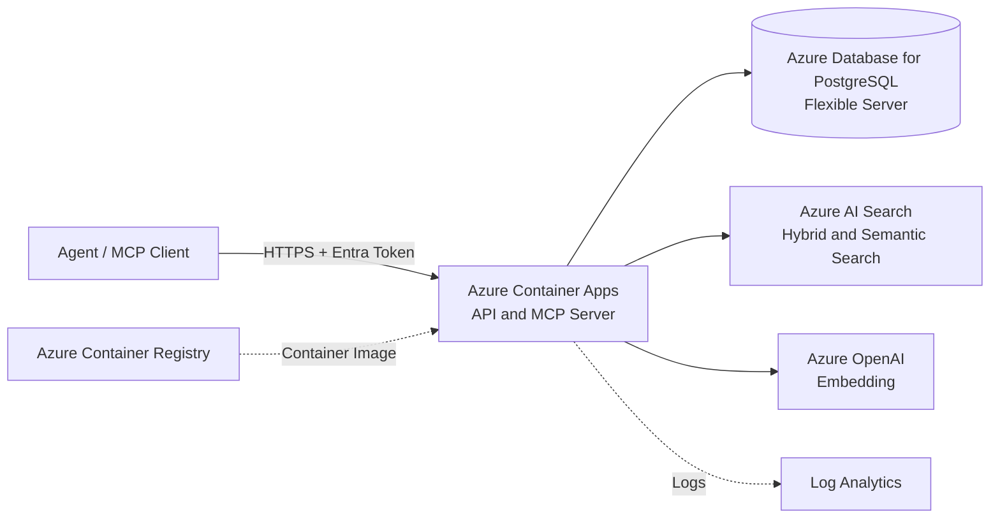
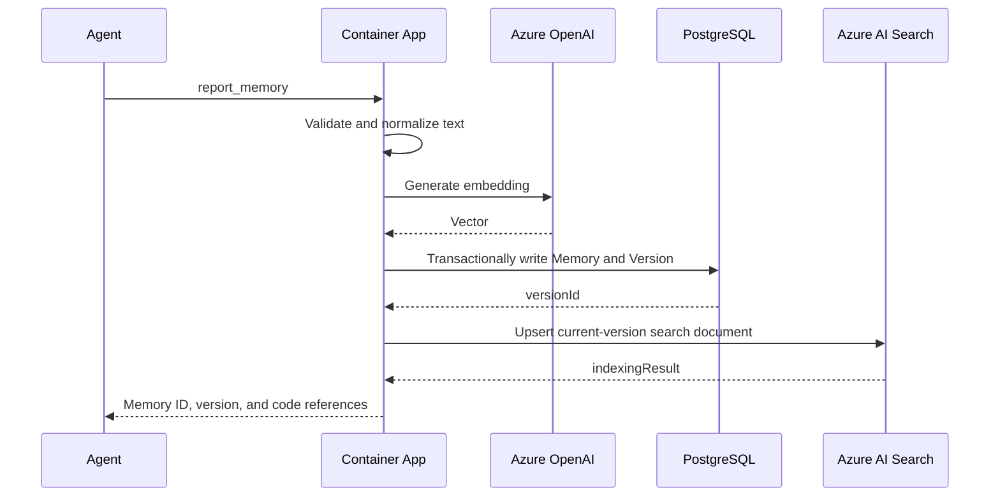

# AI Doc Azure Three-Day MVP Design

This document describes only the smallest system that can be completed within three days. The goal is to complete the core workflow in which an agent writes project memories, queries those memories, and receives code references, without building production-grade platform capabilities prematurely.

## MVP Scope

### Must Deliver

- Agents can report features, API parameters, implementation files, and code symbols.
- The system stores immutable memory versions and code references.
- Agents can query memories using natural language and project filters.
- Queries use both keyword and vector similarity and return sources.
- Agents can mark a specific memory version as useful or not useful and provide a structured quality reason.
- The system provides an HTTP API and a minimal MCP Server.
- The system is deployed to one Azure region and can be called by local agents.

### Out of Scope for Three Days

- Automatically monitoring GitHub or Azure DevOps changes.
- Automatically detecting stale memories, merging conflicts, or analyzing call chains.
- Multi-tenant billing, complex RBAC, or an administration portal.
- Message queues or asynchronous indexing pipelines.
- Private networking, WAF, multiple regions, disaster recovery, or autoscaling optimization.
- Redis caching, object storage, content safety scanning, or advanced auditing.
- Feedback-driven ranking, automatic memory edits, or automatic deletion based on votes.

## Minimal Azure Architecture



The entire application uses one container, one PostgreSQL database, and one Azure AI Search index. PostgreSQL is the system of record for memories and versions, while Azure AI Search stores only searchable projections of current versions. The HTTP API, MCP tools, parameter validation, embedding calls, and index synchronization all run in the same process.

## Azure Services Retained

| Azure Service | Purpose | Why It Is Required |
| --- | --- | --- |
| Azure Container Apps | Run the HTTP API and MCP Server | The only application compute service; simple deployment with built-in HTTPS |
| Azure Database for PostgreSQL Flexible Server | Store memories, versions, and code references | Acts as the system of record for immutable versions and business data |
| Azure AI Search | Provide keyword and vector hybrid retrieval with semantic reranking | Provides a managed index and semantic search without custom retrieval infrastructure |
| Azure OpenAI | Generate embeddings for queries and memories | Enables natural-language semantic retrieval |
| Azure Container Registry | Store the application image | Supplies the deployment image to Container Apps |
| Log Analytics | View Container Apps logs | Supports troubleshooting and basic operational checks during the three-day implementation |

Key Vault is not deployed separately because the service stores no Azure access keys or database password. Azure OpenAI, Azure AI Search, PostgreSQL, and ACR are accessed through the Container Apps user-assigned managed identity.

## Services Removed

| Removed Service | MVP Alternative | When to Introduce It Later |
| --- | --- | --- |
| Azure Front Door | Use the Container Apps HTTPS endpoint directly | When WAF, a global endpoint, or multi-region routing is required |
| API Management | Validate Entra tokens and route versions within the application | When external developers, quotas, or complex API governance are required |
| Azure Service Bus | Write data and generate embeddings synchronously within the request | When write volume causes timeouts or reliable asynchronous processing is required |
| Azure Event Grid | Do not receive repository events yet | When automatic code change detection begins |
| Azure Blob Storage | Store small reports and code references directly in JSONB | When source snapshots or large attachments must be stored |
| Azure Managed Redis | Do not use a cache | When PostgreSQL or model calls become a bottleneck |
| Azure Key Vault | Container Apps secrets | When moving to production or requiring automatic secret rotation |
| App Configuration | Environment variables | When dynamic configuration and feature flags are required |
| Content Safety | Restrict usage to trusted internal projects | When accepting untrusted public content |
| Private Link / Azure Firewall | Service firewalls and TLS | When entering an enterprise production network |
| Multi-region deployment | One region | When explicit SLA, RPO, and RTO requirements exist |

## Application Structure

One service contains four small modules and is not split into microservices:

```text
aidoc-server
  api        HTTP routing, authentication, and parameter validation
  mcp        MCP tool definitions that call the same business functions directly
  memory     Memory writes, version reads, and project filtering
  search     Embeddings, Azure AI Search index synchronization, and hybrid queries
```

HTTP and MCP share the business layer to avoid differences between two implementations. The service remains stateless, all authoritative business data is stored in PostgreSQL, and the Azure AI Search index can be rebuilt at any time.

## Minimal Data Model

### projects

| Field | Type | Description |
| --- | --- | --- |
| `id` | UUID | Project identifier |
| `name` | TEXT | Project name |
| `repository_url` | TEXT | Repository URL |
| `created_at` | TIMESTAMPTZ | Creation time |

### memories

| Field | Type | Description |
| --- | --- | --- |
| `id` | UUID | Memory identifier |
| `project_id` | UUID | Owning project |
| `type` | TEXT | `feature`, `api`, or `decision` |
| `title` | TEXT | Title |
| `current_version` | INTEGER | Current version number |
| `created_at` | TIMESTAMPTZ | Creation time |

### memory_versions

| Field | Type | Description |
| --- | --- | --- |
| `id` | UUID | Version identifier |
| `memory_id` | UUID | Owning memory |
| `version` | INTEGER | Incrementing version number |
| `summary` | TEXT | Feature or API description |
| `details` | JSONB | Parameters, return values, and additional structured information |
| `code_references` | JSONB | Commit, file, symbol, and line numbers |
| `content_text` | TEXT | Normalized text used to rebuild the search index and generate embeddings |
| `created_by` | TEXT | Agent display name; retained as the backward-compatible storage column |
| `actor_id` | TEXT NULL | Trusted Entra `tid:oid`/`tid:sub`; null only for historical versions created before trusted auditing |
| `created_at` | TIMESTAMPTZ | Creation time |

Write requests prefer `agentName`; legacy `createdBy` is accepted as the same untrusted display label. The service ignores request input for `actorId` and derives it from validated Entra claims. Read responses expose both `agentName` and the legacy `createdBy` alias plus trusted `actorId`.

### memory_feedback

Feedback is scoped to an immutable memory version rather than to the mutable memory head.

| Field | Type | Description |
| --- | --- | --- |
| `id` | UUID | Feedback identifier |
| `memory_version_id` | UUID | Version being evaluated |
| `actor_id` | TEXT | Entra `oid` or stable caller subject |
| `sentiment` | TEXT | `useful` or `not_useful` |
| `reason` | TEXT | `useful`, `incorrect`, `stale`, `irrelevant`, or `missing_evidence` |
| `comment` | TEXT NULL | Optional concise correction or context |
| `search_query` | TEXT NULL | Optional query that produced the result; omit when sensitive |
| `created_at` | TIMESTAMPTZ | Initial submission time |
| `updated_at` | TIMESTAMPTZ | Last replacement time |

Create a unique index on `memory_feedback(memory_version_id, actor_id)`. A caller replaces its own current feedback instead of adding multiple votes for the same version. Deleting feedback removes only that caller's record.

Create only the PostgreSQL indexes required for business queries:

- A B-tree index on `memories(project_id, type)`.
- A unique index on `memory_versions(memory_id, version)`.
- A unique index on `memory_feedback(memory_version_id, actor_id)`.

### Azure AI Search Index

Index only the current version of each memory, using the following minimal fields:

| Field | Type | Attributes |
| --- | --- | --- |
| `memoryId` | `Edm.String` | key, filterable |
| `projectId` | `Edm.String` | filterable |
| `type` | `Edm.String` | filterable, facetable |
| `version` | `Edm.Int32` | filterable, sortable |
| `title` | `Edm.String` | searchable, semantic title field |
| `summary` | `Edm.String` | searchable, semantic content field |
| `contentText` | `Edm.String` | searchable, semantic content field |
| `embedding` | `Collection(Edm.Single)` | searchable, HNSW vector field |

Code references remain authoritative in PostgreSQL and are not duplicated in full in the search index. After search returns `memoryId` values, the application reads the current versions from PostgreSQL in a batch and assembles the response.

## API and MCP

### HTTP API

| Operation | Endpoint | Description |
| --- | --- | --- |
| Health check | `GET /health` | Check the application process without calling the model |
| Create project | `POST /v1/projects` | Create a minimal project record |
| List projects | `GET /v1/projects` | Return projects and their identifiers |
| Create memory | `POST /v1/projects/{projectId}/memories` | Create a memory and its first version |
| Revise memory | `POST /v1/memories/{memoryId}/versions` | Append an immutable version |
| Get memory | `GET /v1/memories/{memoryId}` | Return the current version and code references |
| Search memories | `POST /v1/projects/{projectId}/search` | Return Azure AI Search hybrid and semantic retrieval results |
| Submit or replace feedback | `PUT /v1/memories/{memoryId}/versions/{version}/feedback` | Record the caller's version-level quality signal |
| Remove feedback | `DELETE /v1/memories/{memoryId}/versions/{version}/feedback` | Remove the caller's current signal |
| Get feedback summary | `GET /v1/memories/{memoryId}/versions/{version}/feedback-summary` | Return aggregate counts, reasons, and review state |

### MCP Tools

Implement seven tools:

- `create_project`: create a project used to scope memories and searches.
- `list_projects`: list projects and their identifiers.
- `report_memory`: create or revise a feature, API, or decision memory.
- `search_memories`: query relevant memories within a project.
- `get_memory`: read the current version and references for a specific memory.
- `submit_memory_feedback`: submit or replace the caller's feedback for a specific version.
- `get_memory_feedback_summary`: read aggregate quality signals and review state for a specific version.

The MCP surface does not expose actor identity as a parameter. The service derives it from the validated Entra token so one agent cannot vote on behalf of another.

## Write Flow



To keep the implementation simple, embeddings are generated and the search index is updated synchronously during writes. If the Azure OpenAI call fails, the memory is still saved and a document without a vector is written to Azure AI Search so it remains available through keyword queries. If the Azure AI Search update fails, do not roll back the PostgreSQL transaction; return `indexingStatus: pending` and log the error. Provide an Entra-protected `POST /internal/reindex` endpoint that rebuilds or repairs the index from current PostgreSQL versions without introducing a queue or background jobs.

## Query Flow

1. Validate the Entra token and `projectId`.
2. Call Azure OpenAI to generate a query vector; fall back to keyword retrieval if the call fails.
3. Send the text query, vector query, and `projectId` plus optional `type` filters to Azure AI Search.
4. Azure AI Search retrieves candidates using BM25 and vector search, combines them using Reciprocal Rank Fusion, and reranks them with Semantic Ranker.
5. The application reads the matching current versions from PostgreSQL in a batch and returns summaries, versions, and code references for the top 10 memories.
6. The application attaches each returned version's feedback summary and `needsReview` warning from PostgreSQL.

The vector query uses cosine similarity and retrieves at most 50 nearest neighbors. The semantic configuration uses `title` as the title field and `summary` plus `contentText` as content fields. The MVP uses native Azure AI Search hybrid ranking instead of maintaining a separate fixed-weight formula in the application:

- When a query vector is available, use text search, vector search, and semantic reranking.
- When query embedding generation fails, use text search with semantic reranking only.
- When a Semantic Ranker request fails, retry the BM25 and vector hybrid query without semantic reranking.
- Do not return semantic answers; return only stored memory summaries and code references to avoid generating answers that were not persisted.

Do not add custom model-based reranking, time decay, or feedback learning during the three-day implementation.

## Feedback and Quality Review

The visible interaction can be thumbs up or thumbs down, but storage and agent contracts are structured:

- Thumbs up maps to `sentiment: useful` and `reason: useful`.
- Thumbs down maps to `sentiment: not_useful` and requires one of `incorrect`, `stale`, `irrelevant`, or `missing_evidence`.
- `incorrect`, `stale`, and `missing_evidence` set the version summary's `needsReview` flag to `true` when at least one current signal exists.
- `irrelevant` describes retrieval quality for the submitted query and does not by itself assert that the memory is wrong.
- A comment may propose a correction, but feedback never edits memory content or code references.

Feedback summaries contain `usefulCount`, `notUsefulCount`, counts by reason, and `needsReview`. Search and get responses show this summary so agents can treat flagged memories as suspect and verify their evidence before use.

Initial ranking remains BM25, vector retrieval, Reciprocal Rank Fusion, and Semantic Ranker. Do not multiply ranking scores by vote counts until there is enough feedback volume, abuse resistance, offline evaluation, and a version-aware quality model. This prevents a few votes from hiding correct project facts.

## Minimal Security Design

- Container Apps exposes only HTTPS ingress.
- Every business endpoint requires a Microsoft Entra bearer token for the configured API audience.
- The service derives feedback actor identity from validated token claims and never accepts it from request input.
- Container Apps uses a user-assigned managed identity to call PostgreSQL, Azure OpenAI, and Azure AI Search and to pull images from ACR.
- PostgreSQL allows only Azure services and the developer's current outbound IP and enforces TLS.
- By default, store only code locations and summaries, not complete source code.
- Logs must not contain bearer tokens, credential-bearing connection strings, or complete memory contents.
- Logs must not contain feedback comments or search queries; record only feedback reason, version ID, and outcome when operationally necessary.

The Entra App Registration exposes an `access_as_user` delegated scope for interactive agents. Azure workload callers use their own Entra identity; no client secret is required by the AI Doc service.

## Configuration

The application requires only the following environment variables:

| Variable | Description |
| --- | --- |
| `Cloud__ManagedIdentityClientId` | User-assigned managed identity client ID |
| `Cloud__TenantId` | Entra tenant ID used for token validation |
| `Cloud__ApiAudience` | AI Doc API Application ID URI |
| `Cloud__PostgreSql__Host` | PostgreSQL host; authentication uses an Entra token |
| `Cloud__PostgreSql__Database` | PostgreSQL database name |
| `Cloud__PostgreSql__User` | Managed identity principal name |
| `Cloud__Search__Endpoint` | Azure AI Search endpoint |
| `Cloud__Search__IndexName` | Memory index name |
| `Cloud__Search__SemanticConfigurationName` | Semantic configuration name |
| `Cloud__OpenAi__Endpoint` | Azure OpenAI endpoint |
| `Cloud__OpenAi__EmbeddingDeployment` | Embedding deployment name |
| `Cloud__OpenAi__EmbeddingDimensions` | Vector dimensions matching the Search vector field |

## Three-Day Implementation Plan

### Day 1: Core Workflow

- Create ACR, PostgreSQL, Azure OpenAI, Azure AI Search, and a Container Apps environment.
- Create the project, memory, and version tables, plus the Azure AI Search hybrid vector index and semantic configuration.
- Create the monolithic service and implement `/health`, project creation, and memory writes.
- Complete database integration tests locally.

Completion criteria: a memory with code references can be written over HTTP and read back from PostgreSQL.

### Day 2: Retrieval and MCP

- Integrate Azure OpenAI embeddings.
- Implement Azure AI Search index synchronization, keyword and vector hybrid queries, and semantic reranking.
- Implement the seven MCP tools and reuse the HTTP business layer.
- Add fallback behavior for embedding failures and the manual index rebuild endpoint.
- Implement version-scoped feedback submission, summary reads, and `needsReview` warnings without changing ranking.

Completion criteria: an agent can report a feature and find it, together with its code references, using a different natural-language description.

### Day 3: Deployment and Acceptance

- Build the image, push it to ACR, and deploy it to Container Apps.
- Configure the managed identity, Entra API application, HTTPS ingress, and database firewall.
- Add Entra authentication, structured logging, and minimal error handling.
- Run end-to-end tests and add invocation examples and deployment instructions.

Completion criteria: a local IDE agent can call the MCP Server in Azure; memories survive a service restart; and keyword retrieval remains available during a temporary Azure OpenAI failure.

## Acceptance Checklist

- [ ] HTTP and MCP use the same memory write and query logic.
- [ ] Revising a memory creates a new version without overwriting version history.
- [ ] Queries are strictly scoped to the specified project.
- [ ] Every query result includes `memoryId`, `version`, `summary`, and `codeReferences`.
- [ ] Writes and keyword retrieval continue to work when Azure OpenAI is unavailable.
- [ ] The Azure AI Search index can be rebuilt completely from current PostgreSQL versions.
- [ ] Feedback is scoped to an immutable version and one actor has at most one current signal per version.
- [ ] Negative feedback requires a structured reason and cannot modify or delete a memory.
- [ ] Search and get responses expose feedback summary and `needsReview` without changing ranking.
- [ ] Bearer tokens, access keys, client secrets, and credential-bearing connection strings do not appear in the repository, image, or logs.
- [ ] Request errors and retrieval latency are visible in Container Apps.

## Scaling Triggers

Do not add services preemptively based on time. Scale only when a specific problem appears:

| Observed Problem | Next Step |
| --- | --- |
| Writes frequently time out while generating embeddings | Introduce Service Bus and a separate worker |
| Azure AI Search query P95 or capacity approaches its limit | Adjust the SKU, partition count, or replica count |
| Commit events must be processed automatically | Introduce Event Grid and invalidation analysis jobs |
| Large source snapshots must be stored | Introduce Blob Storage |
| Multiple teams need different permissions | Integrate Entra ID and project-level RBAC |
| Public production traffic requires protection | Introduce API Management, Front Door, and WAF |
| An explicit cross-region SLA is required | Design a second region and failover |