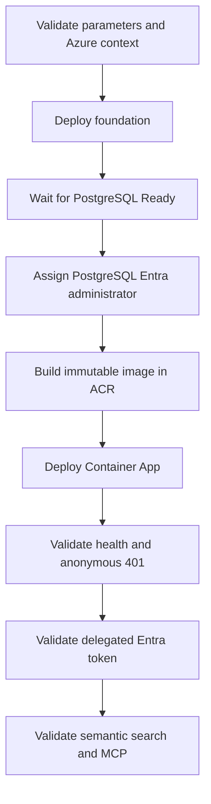

# AI Doc Cloud Deployment Knowledge Index

## Agent contract

Use this package when an agent must deploy, repair, validate, operate, or connect to AI Doc Cloud. Repository source and Bicep are authoritative. Concrete resource names and IDs are deployment evidence, not reusable defaults.

Hard invariants:

1. Never create, request, store, or print Azure access keys, database passwords, client secrets, or credential-bearing connection strings.
2. Runtime access to PostgreSQL, Azure AI Search, Azure OpenAI, and ACR uses one user-assigned managed identity.
3. Inbound HTTP and MCP access uses Microsoft Entra bearer tokens; it is separate from outbound managed identity.
4. PostgreSQL is authoritative. Azure AI Search is a rebuildable current-version projection.
5. Names, region, model deployment, capacity, image repository, and image tag are configurable.
6. Use an immutable image tag for every code deployment.
7. Stop after the first failed Azure CLI operation and diagnose that phase.

## Knowledge routing

| Intent | Read first | Then read |
| --- | --- | --- |
| Authentication and RBAC | [01-identity-and-entra.md](01-identity-and-entra.md) | [05-verification-and-operations.md](05-verification-and-operations.md) |
| Names, region, model, quota | [02-parameters-and-regional-preflight.md](02-parameters-and-regional-preflight.md) | [03-deployment-runbook.md](03-deployment-runbook.md) |
| Deploy or update | [03-deployment-runbook.md](03-deployment-runbook.md) | [05-verification-and-operations.md](05-verification-and-operations.md) |
| Recover failure | [04-failure-recovery.md](04-failure-recovery.md) | The failed phase's source file |
| Install or call MCP | [06-mcp-agent-usage.md](06-mcp-agent-usage.md) | [01-identity-and-entra.md](01-identity-and-entra.md) |

## Deployment graph

## Authoritative source map

| Concern | Source |
| --- | --- |
| Orchestration | [../../infra/deploy.ps1](../../infra/deploy.ps1) |
| Resources, local-auth disablement, RBAC | [../../infra/foundation.bicep](../../infra/foundation.bicep) |
| PostgreSQL Entra administrator | [../../infra/postgres-administrator.bicep](../../infra/postgres-administrator.bicep) |
| Container App identity/configuration | [../../infra/app.bicep](../../infra/app.bicep) |
| Parameter schema | [../../infra/deploy.parameters.json](../../infra/deploy.parameters.json) |
| JWT and managed identity | [../../src/AiDoc.Cloud.Api/Program.cs](../../src/AiDoc.Cloud.Api/Program.cs) |
| PostgreSQL token refresh | [../../src/AiDoc.Cloud.Api/Infrastructure/PostgresDataSourceFactory.cs](../../src/AiDoc.Cloud.Api/Infrastructure/PostgresDataSourceFactory.cs) |
| Search index/query | [../../src/AiDoc.Cloud.Api/Infrastructure/AzureSearchMemoryIndex.cs](../../src/AiDoc.Cloud.Api/Infrastructure/AzureSearchMemoryIndex.cs) |
| MCP tools | [../../src/AiDoc.Cloud.Api/Api/MemoryTools.cs](../../src/AiDoc.Cloud.Api/Api/MemoryTools.cs) |

## Verified evidence

The 2026-08-20 deployment used `westus3`, PostgreSQL 16 `Standard_B1ms`, Search Basic, and `text-embedding-3-small` with `GlobalStandard`, 30K TPM, and 1536 dimensions. Revalidate region and quota for every new deployment.

Validated behavior: health 200, anonymous business request 401, delegated Entra request accepted, empty semantic search succeeded through OpenAI and Search MSI access, and MCP `initialize` returned 200 `text/event-stream`.
