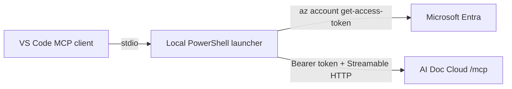

# Configure AI Doc MCP Locally in VS Code

## Agent contract

Use this document to install or repair the AI Doc Cloud MCP connection in a developer's VS Code profile. The preferred configuration obtains a fresh Microsoft Entra token whenever the MCP process starts. Never persist bearer tokens, Azure access keys, client secrets, or database credentials.

This document is local repository guidance only. Do not upload it to AI Doc memory unless explicitly requested.

## Expected result

After configuration, VS Code dynamically exposes these tools:

- `create_project`
- `list_projects`
- `report_memory`
- `search_memories`
- `get_memory`

Tool names shown to an agent may include a sanitized server prefix, for example `mcp_aidoc_cloud_a_list_projects`.

## Why use a local stdio launcher

AI Doc Cloud exposes Streamable HTTP at:

```text
https://<container-app-fqdn>/mcp
```

The endpoint requires an Entra delegated access token. A static `Authorization` header in `.vscode/mcp.json` expires, and the current service does not expose MCP OAuth discovery metadata. The validated configuration therefore uses:



The token exists only in the launcher's process environment and is removed on exit.

## Prerequisites

- VS Code with MCP support. The validated version was 1.134.
- PowerShell 7 available as `pwsh`.
- Node.js 18 or later.
- npm.
- Azure CLI.
- An Entra App Registration exposing `access_as_user`.
- The signed-in user has consent or the calling client is preauthorized.
- The AI Doc Cloud endpoint is healthy.

Check prerequisites:

```powershell
code --version
pwsh --version
node --version
npm --version
az account show --query '{tenantId:tenantId,user:user.name}' -o json
```

## Required local values

The only required deployment-specific input is the AI Doc instance origin or its discovery URL:

```text
https://<container-app-fqdn>/.well-known/aidoc-mcp.json
```

Read the public, non-secret metadata:

```powershell
$origin = 'https://<container-app-fqdn>'
$discovery = Invoke-RestMethod "$origin/.well-known/aidoc-mcp.json"
$discovery | Select-Object tenantId, clientId, delegatedScope, mcpEndpoint, documentation, llms
```

The discovery response supplies:

| Value | Format |
| --- | --- |
| Tenant ID | UUID |
| API client ID | UUID |
| Delegated scope | `api://<client-id>/access_as_user` |
| MCP endpoint | `https://<container-app-fqdn>/mcp` |

These values identify the deployed API and are not secrets. The response intentionally excludes tokens, client secrets, access keys, database credentials, and the Container App managed identity client ID.

Agents should rediscover these values per environment rather than copying IDs from another deployment.

## 1. Verify Entra token acquisition

```powershell
$discovery = Invoke-RestMethod 'https://<container-app-fqdn>/.well-known/aidoc-mcp.json'
az account get-access-token `
  --scope $discovery.delegatedScope `
  --query '{expiresOn:expiresOn,tenant:tenant}' `
  --output json `
  --only-show-errors
```

This command intentionally does not print the token. If it returns `consent_required`, verify that the API exposes `access_as_user` and that Azure CLI is preauthorized or consented.

When interactive login is required:

```powershell
az login `
  --tenant $discovery.tenantId `
  --scope $discovery.delegatedScope
```

Never ask a user to paste an access token into chat.

## 2. Install a pinned HTTP-to-stdio bridge

Install under a Git-ignored local directory:

```powershell
npm install `
  --prefix .local/aidoc-cloud/mcp-client `
  --save-exact `
  mcp-remote@0.1.38
```

Verify:

```powershell
npm list `
  --prefix .local/aidoc-cloud/mcp-client `
  mcp-remote `
  --depth=0
```

Pin the version. Do not depend on `npx ...@latest` during every VS Code startup.

## 3. Create the launcher

Create `.local/aidoc-cloud/start-mcp.ps1`:

```powershell
$ErrorActionPreference = 'Stop'

$discoveryUrl = 'https://<container-app-fqdn>/.well-known/aidoc-mcp.json'
$proxy = Join-Path $PSScriptRoot 'mcp-client/node_modules/mcp-remote/dist/proxy.js'

if (-not (Test-Path $proxy)) {
    throw "mcp-remote is not installed at '$proxy'."
}

$discovery = Invoke-RestMethod $discoveryUrl
$tokenResult = az account get-access-token `
  --scope $discovery.delegatedScope `
  --query '{accessToken:accessToken,expiresOn:expires_on}' `
  --output json `
  --only-show-errors | ConvertFrom-Json
if ($LASTEXITCODE -ne 0 -or [string]::IsNullOrWhiteSpace($tokenResult.accessToken)) {
  throw "Unable to acquire an Entra token. Run 'az login --tenant $($discovery.tenantId) --scope $($discovery.delegatedScope)'."
}

$restartAt = [DateTimeOffset]::FromUnixTimeSeconds([long]$tokenResult.expiresOn).AddMinutes(-5)
if ($restartAt -le [DateTimeOffset]::UtcNow) {
  throw 'The acquired Entra token expires too soon to start an MCP session.'
}

$startInfo = [Diagnostics.ProcessStartInfo]::new()
$startInfo.FileName = (Get-Command node -ErrorAction Stop).Source
$startInfo.UseShellExecute = $false
$startInfo.RedirectStandardInput = $true
$startInfo.RedirectStandardOutput = $true
$startInfo.RedirectStandardError = $true
$startInfo.ArgumentList.Add($proxy)
$startInfo.ArgumentList.Add($discovery.mcpEndpoint)
$startInfo.ArgumentList.Add('--transport')
$startInfo.ArgumentList.Add('http-only')
$startInfo.ArgumentList.Add('--header')
$startInfo.ArgumentList.Add('Authorization:${AIDOC_ENTRA_AUTH_HEADER}')
$startInfo.ArgumentList.Add('--silent')
$startInfo.Environment['AIDOC_ENTRA_AUTH_HEADER'] = "Bearer $($tokenResult.accessToken)"

$proxyProcess = [Diagnostics.Process]::new()
$proxyProcess.StartInfo = $startInfo
try {
  if (-not $proxyProcess.Start()) {
    throw 'Unable to start the MCP proxy process.'
  }

  $inputCopy = [Console]::OpenStandardInput().CopyToAsync($proxyProcess.StandardInput.BaseStream)
  $outputCopy = $proxyProcess.StandardOutput.BaseStream.CopyToAsync([Console]::OpenStandardOutput())
  $errorCopy = $proxyProcess.StandardError.BaseStream.CopyToAsync([Console]::OpenStandardError())

  while (-not $proxyProcess.WaitForExit(1000)) {
    if ([DateTimeOffset]::UtcNow -ge $restartAt) {
      $proxyProcess.Kill($true)
      $proxyProcess.WaitForExit()
      exit 0
    }
  }

  $exitCode = $proxyProcess.ExitCode
  $null = [Threading.Tasks.Task]::WaitAll([Threading.Tasks.Task[]]@($outputCopy, $errorCopy), 5000)
  exit $exitCode
}
finally {
  if (-not $proxyProcess.HasExited) {
    $proxyProcess.Kill($true)
  }
  $proxyProcess.Dispose()
}
```

Security properties:

- Client ID, tenant, scope, and MCP endpoint are discovered from the target instance.
- Token is requested at process start.
- Token is not passed as a command-line argument.
- Token is not written to disk.
- Child process receives it through one environment variable.
- The proxy exits five minutes before token expiry so VS Code can restart it with a fresh token.
- The token environment variable exists only in the child process and disappears with that process.

Confirm `.local` is ignored:

```powershell
git check-ignore -v .local/aidoc-cloud/start-mcp.ps1
```

## 4. Validate the launcher before VS Code registration

Run as a persistent process:

```powershell
pwsh -NoProfile -File .local/aidoc-cloud/start-mcp.ps1
```

Send one JSON-RPC object per line:

```json
{"jsonrpc":"2.0","id":1,"method":"initialize","params":{"protocolVersion":"2025-06-18","capabilities":{},"clientInfo":{"name":"local-smoke","version":"1.0"}}}
```

Then:

```json
{"jsonrpc":"2.0","method":"notifications/initialized"}
{"jsonrpc":"2.0","id":2,"method":"tools/list","params":{}}
```

Require server name `AiDoc.Cloud.Api` and all five tools. Keep stdin open while waiting for replies; a one-shot pipeline can terminate the proxy too early.

## 5. Register in the VS Code user profile

VS Code supports:

```text
code --add-mcp <json>
```

Register a stdio server whose command is:

```text
pwsh -NoProfile -File <absolute-path-to-start-mcp.ps1>
```

PowerShell example:

```powershell
$definition = @{
    name = 'aidoc-cloud-entra'
    command = 'pwsh'
    args = @(
        '-NoProfile',
        '-File',
        '<absolute-path-to-start-mcp.ps1>'
    )
} | ConvertTo-Json -Compress

code --add-mcp $definition
```

On Windows, `code.cmd` may strip JSON quotes. If that occurs, pass explicitly escaped JSON. A successful command prints:

```text
Added MCP servers: aidoc-cloud-entra
```

Use the CLI to write supported profile storage. Do not edit undocumented VS Code profile databases.

## 6. Reload and verify directly in Code

Run **Developer: Reload Window** when tools do not appear immediately.

For an agent session, search the dynamic tool registry for exact tool names. A successful configuration exposes a namespace similar to:

```text
mcp_aidoc_cloud_a_list_projects
mcp_aidoc_cloud_a_search_memories
```

Direct verification sequence:

1. Call `list_projects`; require a JSON project list.
2. Call `search_memories` with a known project ID and behavior-language query.
3. Confirm the expected memory title and ID.

This proves Code is invoking the configured MCP directly. Do not start `start-mcp.ps1` manually for normal usage; VS Code starts it as needed.

## Direct HTTP configuration for temporary debugging

Workspace configuration can point directly to HTTP:

```json
{
  "servers": {
    "aidoc-cloud": {
      "type": "http",
      "url": "${env:AIDOC_CLOUD_MCP_URL}",
      "headers": {
        "Authorization": "Bearer ${env:AIDOC_CLOUD_TOKEN}"
      }
    }
  }
}
```

This is not the preferred persistent setup because `AIDOC_CLOUD_TOKEN` expires and VS Code does not refresh that environment variable automatically. Use it only for short-lived protocol diagnosis.

## Troubleshooting matrix

| Symptom | Check | Recovery |
| --- | --- | --- |
| Dynamic tools absent | VS Code reload, user-profile registration, launcher path | Reload; rerun `code --add-mcp` |
| Discovery endpoint fails | Instance origin, `/health`, DNS, ingress | Fix instance URL before debugging Entra |
| `consent_required` | Delegated scope and client preauthorization | Fix Entra scope/consent; login again |
| Launcher exits immediately | Azure login, Node path, proxy path | Run launcher manually and inspect non-secret error |
| MCP returns 401 | Token `aud`, `iss`, `tid`, `scp` | Verify scope, tenant, and API audience validation |
| `tools/list` works but an operation fails | Project ID and tool schema | Call `list_projects`; use returned UUID |
| Old tool surface remains | Active Container App image/revision, VS Code MCP cache | Deploy immutable image tag; reload window |
| One-shot smoke test has no response | stdin closed before proxy response | Use persistent process |

## Removal and reinstall

Remove or disable the server through VS Code's MCP management UI/profile controls. Delete `.local/aidoc-cloud/mcp-client` and the launcher only after the profile entry is removed. Reinstall with the same pinned package and repeat protocol validation.

## Completion criteria

Configuration is complete only when:

- Token acquisition succeeds without printing or persisting the token.
- Launcher `initialize` and `tools/list` succeed.
- VS Code dynamically exposes all five tools.
- A direct Code `list_projects` call succeeds.
- A direct Code semantic search returns an expected memory.
