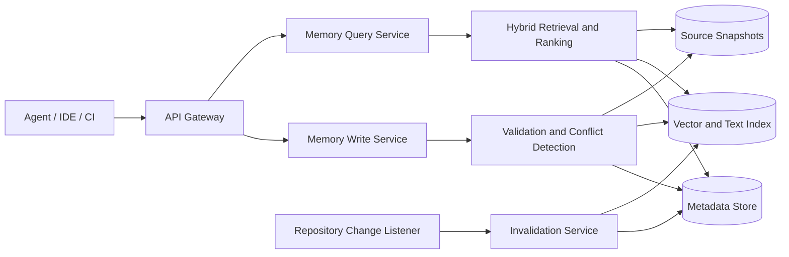

# AI Doc

AI Doc 是一个面向 AI Agent 的项目长时记忆系统。它持续记录代码库中的功能、接口、实现位置及其演进历史，让 Agent 在跨会话工作时能够快速恢复上下文，并基于可追溯的项目事实进行分析和修改。

当前实现目标是 3 天内完成核心闭环：

- [AI Doc 单机 CLI 架构设计](standalone-architecture.md)：无需部署服务，适合本机 Agent 和个人开发。
- [AI Doc Azure 三天 MVP 设计](azure-architecture.md)：适合需要远程访问和共享数据的团队。

## 目标

- 将分散在代码、文档和 Agent 会话中的知识沉淀为结构化记忆。
- 让 Agent 能按功能、接口、符号或自然语言检索相关实现。
- 保证每条记忆都可追溯到具体仓库、提交和代码位置。
- 在代码发生变化时识别过期记忆，避免向 Agent 提供失真的上下文。

## 核心功能

### 记忆写入

- Agent 报告功能模块的职责、关键流程、实现文件和核心符号。
- 记录接口定义，包括路径、方法、请求参数、响应结构、错误码和调用示例。
- 自动关联功能、接口、代码符号、依赖模块和设计决策。
- 支持新增、修订、废弃和合并记忆，并保留完整版本历史。
- 保存信息来源、代码提交、生成者和时间等溯源信息。
- 对重复或冲突的报告进行检测，交由规则或 Agent 合并确认。

### 记忆检索

- 使用自然语言查询功能、接口参数、调用链或具体实现。
- 按仓库、分支、提交、模块、语言、标签和时间范围过滤结果。
- 返回摘要的同时提供代码位置和来源，便于 Agent 进一步验证。
- 支持沿关系浏览，例如“功能使用哪些接口”或“接口由哪些符号实现”。
- 根据语义相关度、关键词匹配、时效性和可信度对结果排序。

### 生命周期管理

- 在提交或合并请求变更后，分析受影响的记忆并标记为待验证或已过期。
- 定期检查失效的文件路径、符号和接口定义。
- 支持人工确认、回滚、归档和删除。
- 提供项目级数据隔离、访问控制和审计日志。

### Agent 集成

- 提供 HTTP API 和 MCP Server，供不同 Agent 统一读写记忆。
- 为常见 Agent 工作流提供“报告模块”“查询实现”“查询接口”和“刷新记忆”等工具。
- 支持批量导入代码分析结果及按需加载上下文，控制 Token 消耗。
- 返回机器可读的结构化结果，避免 Agent 二次解析自然语言文档。

## 典型工作流

### 报告功能

1. Agent 完成功能分析或代码修改。
2. Agent 提交功能摘要、接口、代码引用及当前提交版本。
3. 系统校验引用是否存在，并查找重复或冲突记忆。
4. 系统保存新版本，更新关系索引和检索索引。

### 查询功能

1. Agent 使用自然语言描述任务，并附带当前仓库和提交信息。
2. 系统执行关键词、结构化关系和向量混合检索。
3. 系统根据相关度、时效性和可信度重排候选记忆。
4. 系统返回摘要、接口详情、代码引用和过期状态。
5. Agent 根据引用读取源代码，验证后继续工作或更新记忆。

## 高级别设计

### 接入层

对外提供 HTTP API、MCP 工具和事件入口，负责身份认证、项目定位、限流及请求格式校验。所有请求都必须携带项目标识；涉及代码事实的请求还应携带分支或提交版本。

### 写入链路

写入服务将 Agent 报告规范化为结构化实体，校验文件和符号引用，识别重复、冲突及敏感信息，再以新版本写入存储。写入成功后异步更新全文索引和向量索引。

### 查询链路

查询服务先使用项目、版本和实体类型缩小范围，再结合全文检索、向量检索及实体关系召回候选结果。排序阶段综合语义相关度、关键词命中、来源可信度、代码版本距离和更新时间。响应包含答案所依据的记忆与源代码引用，而不是只返回生成文本。

### 变更感知

仓库监听器消费提交、合并请求或 CI 事件，根据变更文件和符号定位受影响记忆。系统不直接删除旧记忆，而是将其状态调整为 `needs_review` 或 `stale`，待 Agent 或维护者生成新版本。

### 存储设计

- **元数据存储**：保存项目、实体、关系、版本、权限和审计数据；适合使用关系型数据库。
- **检索索引**：保存可检索文本、向量及过滤字段，支持混合检索。
- **对象存储**：保存较大的源码快照、分析报告和导入文件。
- **任务队列**：承载索引更新、冲突检测、代码解析和失效检查等异步任务。

## 核心数据模型

| 实体 | 关键字段 | 说明 |
| --- | --- | --- |
| Project | `id`、`repository`、`defaultBranch` | 记忆隔离边界 |
| Memory | `id`、`type`、`title`、`summary`、`status` | 功能、接口、决策等记忆的统一载体 |
| MemoryVersion | `memoryId`、`content`、`commit`、`createdBy` | 不可变的记忆版本 |
| CodeReference | `repository`、`commit`、`path`、`symbol`、`lines` | 指向可验证的代码事实 |
| Relation | `sourceId`、`targetId`、`type` | 功能、接口、模块和符号之间的关系 |
| Evidence | `memoryVersionId`、`sourceType`、`sourceUri` | 记忆的来源与可信度依据 |

记忆状态建议使用：`active`、`needs_review`、`stale`、`deprecated` 和 `archived`。

## API 草案

| 操作 | 接口 | 用途 |
| --- | --- | --- |
| 写入记忆 | `POST /v1/projects/{projectId}/memories` | 报告功能、接口或设计决策 |
| 修订记忆 | `POST /v1/memories/{memoryId}/versions` | 创建不可变的新版本 |
| 查询记忆 | `POST /v1/projects/{projectId}/search` | 执行自然语言和结构化混合检索 |
| 获取记忆 | `GET /v1/memories/{memoryId}` | 查看详情、关系和版本 |
| 标记失效 | `POST /v1/projects/{projectId}/invalidation-jobs` | 根据代码变更检查过期记忆 |
| 提交反馈 | `POST /v1/memories/{memoryId}/feedback` | 报告结果有用、错误或已过期 |

所有查询结果至少应包含 `memoryId`、`version`、`status`、`score`、`summary`、`codeReferences` 和 `evidence`。

## 非功能要求

- **可追溯性**：代码相关结论必须能定位到提交和文件；无法验证的内容需明确标记。
- **一致性**：记忆版本不可变，索引允许最终一致，但查询结果必须暴露索引版本。
- **安全性**：支持租户隔离、最小权限、敏感信息过滤、传输与静态加密。
- **可观测性**：记录写入成功率、查询延迟、召回质量、过期率和冲突率。
- **可扩展性**：代码解析器、Embedding 模型、排序器和存储实现均应可替换。

## 实施阶段

1. **MVP**：实现项目隔离、功能与接口记忆写入、关键词检索、版本和代码引用。
2. **语义检索**：增加向量检索、混合排序、关系浏览及 MCP Server。
3. **变更感知**：接入仓库事件，实现受影响记忆检测和过期标记。
4. **质量治理**：增加冲突合并、反馈学习、权限、审计和质量指标。

## 设计原则

- 记忆是带来源和版本的项目事实，不是无依据的对话摘要。
- 检索结果优先提供可验证的上下文，再由 Agent 形成结论。
- 写入采用追加版本，避免覆盖历史和丢失决策过程。
- 默认按需返回最少必要上下文，降低噪声与 Token 成本。