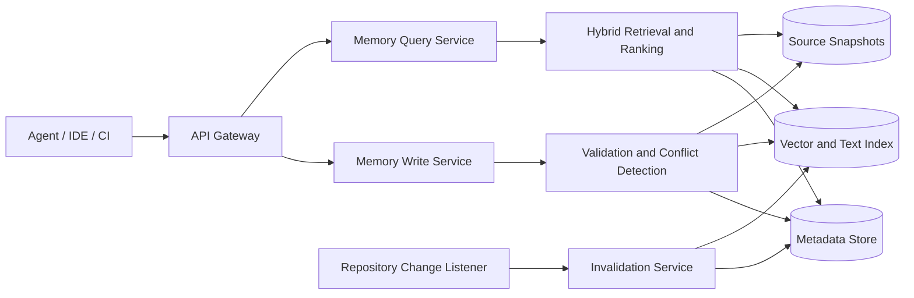

# FactLineage

FactLineage is a long-term project memory system for AI agents. It continuously records the features, interfaces, implementation locations, and evolution history of a codebase, enabling agents to quickly restore context across sessions and analyze or modify a project based on traceable facts.

The current implementation goal is to complete the core workflow within three days:

- [FactLineage Standalone CLI Architecture](standalone-architecture.md): requires no service deployment and is suitable for local agents and individual developers.
- [FactLineage Azure Three-Day MVP Architecture](azure-architecture.md): designed for teams that need remote access and shared data.

## Goals

- Consolidate knowledge scattered across code, documentation, and agent sessions into structured memories.
- Enable agents to retrieve relevant implementations by feature, interface, symbol, or natural-language query.
- Ensure that every memory can be traced to a specific repository, commit, and code location.
- Identify outdated memories when code changes to prevent agents from receiving inaccurate context.

## Core Features

### Memory Ingestion

- Agents report the responsibilities, key workflows, implementation files, and core symbols of feature modules.
- Record interface definitions, including paths, methods, request parameters, response structures, error codes, and usage examples.
- Automatically associate features, interfaces, code symbols, dependent modules, and design decisions.
- Support creating, revising, deprecating, and merging memories while preserving complete version history.
- Store provenance information such as sources, code commits, authors, and timestamps.
- Detect duplicate or conflicting reports and submit them for rule-based or agent-assisted merge confirmation.

### Memory Retrieval

- Use natural-language queries to find features, interface parameters, call chains, or specific implementations.
- Filter results by repository, branch, commit, module, language, tag, and time range.
- Return code locations and sources alongside summaries so agents can verify the results.
- Support relationship traversal, such as identifying which interfaces a feature uses or which symbols implement an interface.
- Rank results by semantic relevance, keyword matches, recency, and confidence.

### Lifecycle Management

- Analyze affected memories after a commit or pull request changes and mark them as needing review or stale.
- Periodically check for invalid file paths, symbols, and interface definitions.
- Support manual confirmation, rollback, archival, and deletion.
- Provide project-level data isolation, access control, and audit logs.

### Version-Level Quality Feedback

- Let an authenticated agent mark a specific immutable version as `useful` or `not_useful`.
- Require negative feedback to identify `incorrect`, `stale`, `irrelevant`, or `missing_evidence`.
- Keep at most one current feedback record per actor and version; a new submission replaces that actor's prior signal.
- Mark versions with current `incorrect`, `stale`, or `missing_evidence` signals as `needsReview` without editing or deleting memory content.
- Expose aggregate counts and reasons to later agents so they can verify suspect evidence before use.
- Keep initial retrieval ranking independent of feedback until volume, abuse resistance, and offline evaluation justify a quality model.

### Agent Integration

- Provide an HTTP API and MCP Server for consistent memory access across agents.
- Provide tools for common agent workflows, including reporting modules, querying implementations, querying interfaces, and refreshing memories.
- Support bulk import of code analysis results and on-demand context loading to control token usage.
- Return machine-readable structured results so agents do not need to parse natural-language documents again.

## Typical Workflows

### Report a Feature

1. An agent completes a feature analysis or code change.
2. The agent submits a feature summary, interfaces, code references, and the current commit version.
3. The system validates that references exist and searches for duplicate or conflicting memories.
4. The system saves a new version and updates the relationship and retrieval indexes.

### Query a Feature

1. An agent describes the task in natural language and includes the current repository and commit information.
2. The system performs hybrid retrieval using keywords, structured relationships, and vectors.
3. The system reranks candidates by relevance, recency, and confidence.
4. The system returns summaries, interface details, code references, and stale status.
5. The agent reads the referenced source code, verifies the results, and then continues the work or updates the memory.

## High-Level Design

### Access Layer

The access layer exposes an HTTP API, MCP tools, and event endpoints. It is responsible for authentication, project identification, rate limiting, and request validation. Every request must include a project identifier. Requests involving code facts should also include a branch or commit version.

### Write Pipeline

The write service normalizes agent reports into structured entities, validates file and symbol references, detects duplicates, conflicts, and sensitive information, and then writes a new version to storage. After a successful write, it asynchronously updates the full-text and vector indexes.

### Query Pipeline

The query service first narrows the search scope by project, version, and entity type. It then retrieves candidates using full-text search, vector search, and entity relationships. Ranking combines semantic relevance, keyword matches, source confidence, distance from the current code version, and update time. Responses include the memories and source code references that support the answer rather than returning only generated text.

### Change Awareness

The repository listener consumes commit, pull request, or CI events and uses changed files and symbols to locate affected memories. The system does not directly delete old memories. Instead, it changes their status to `needs_review` or `stale` until an agent or maintainer creates a new version.

### Storage Design

- **Metadata store**: stores projects, entities, relationships, versions, permissions, and audit data; a relational database is suitable.
- **Retrieval index**: stores searchable text, vectors, and filter fields to support hybrid retrieval.
- **Object storage**: stores larger source snapshots, analysis reports, and imported files.
- **Task queue**: handles asynchronous tasks such as index updates, conflict detection, code parsing, and invalidation checks.

## Core Data Model

| Entity | Key Fields | Description |
| --- | --- | --- |
| Project | `id`, `repository`, `defaultBranch` | Memory isolation boundary |
| Memory | `id`, `type`, `title`, `summary`, `status` | Unified container for feature, interface, decision, and other memories |
| MemoryVersion | `memoryId`, `content`, `commit`, `agentName`, `actorId` | Immutable version with an agent display label and trusted Entra actor identity |
| CodeReference | `repository`, `commit`, `path`, `symbol`, `lines` | Reference to a verifiable code fact |
| Relation | `sourceId`, `targetId`, `type` | Relationship between features, interfaces, modules, and symbols |
| Evidence | `memoryVersionId`, `sourceType`, `sourceUri` | Source and confidence evidence for a memory |

Recommended memory statuses are `active`, `needs_review`, `stale`, `deprecated`, and `archived`.

## API Draft

| Operation | Endpoint | Purpose |
| --- | --- | --- |
| Create memory | `POST /v1/projects/{projectId}/memories` | Report a feature, interface, or design decision |
| Revise memory | `POST /v1/memories/{memoryId}/versions` | Create an immutable new version |
| Search memories | `POST /v1/projects/{projectId}/search` | Perform natural-language and structured hybrid retrieval |
| Get memory | `GET /v1/memories/{memoryId}` | View details, relationships, and versions |
| Mark invalid | `POST /v1/projects/{projectId}/invalidation-jobs` | Check for stale memories based on code changes |
| Submit or replace feedback | `PUT /v1/memories/{memoryId}/versions/{version}/feedback` | Record the caller's version-level quality signal |
| Remove feedback | `DELETE /v1/memories/{memoryId}/versions/{version}/feedback` | Remove the caller's current signal |
| Get feedback summary | `GET /v1/memories/{memoryId}/versions/{version}/feedback-summary` | Return aggregate counts, reasons, and review state |

Every query result should include at least `memoryId`, `version`, `status`, `score`, `summary`, `codeReferences`, and `evidence`.

## Non-Functional Requirements

- **Traceability**: conclusions about code must identify a commit and file location; unverifiable information must be explicitly marked.
- **Author auditing**: derive `actorId` from validated authentication claims; treat `agentName` as a caller-supplied display label and accept `createdBy` only as a compatibility alias.
- **Consistency**: memory versions are immutable. Indexes may be eventually consistent, but query results must expose the index version.
- **Security**: support tenant isolation, least privilege, sensitive information filtering, and encryption in transit and at rest.
- **Observability**: track write success rate, query latency, retrieval quality, stale rate, and conflict rate.
- **Extensibility**: code parsers, embedding models, rankers, and storage implementations must be replaceable.

## Implementation Phases

1. **MVP**: implement project isolation, feature and interface memory ingestion, keyword retrieval, versioning, and code references.
2. **Semantic Retrieval**: add vector retrieval, hybrid ranking, relationship traversal, and an MCP Server.
3. **Change Awareness**: integrate repository events to detect affected memories and mark stale entries.
4. **Quality Governance**: add conflict merging, feedback learning, permissions, auditing, and quality metrics.

## Design Principles

- A memory is a project fact with a source and version, not an unsupported conversation summary.
- Retrieval results prioritize verifiable context, which an agent then uses to form conclusions.
- Writes append new versions to avoid overwriting history or losing the decision process.
- By default, return only the minimum context needed to reduce noise and token usage.