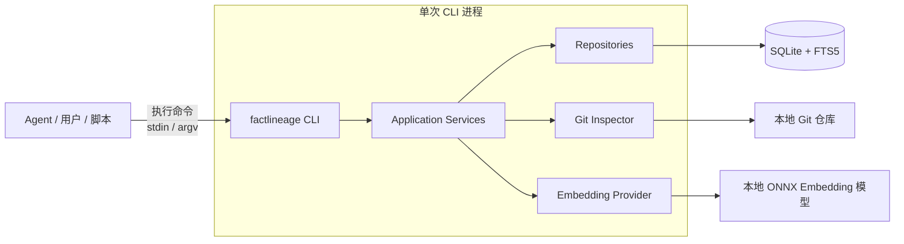
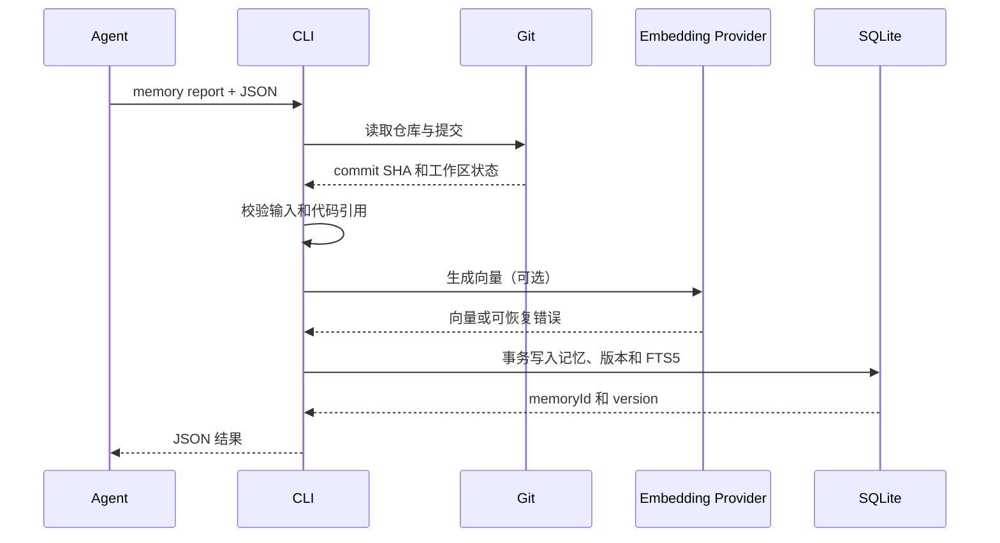

# FactLineage 单机 CLI 架构设计

本文描述 FactLineage 的单机版本。目标是在不部署服务、不运行常驻进程的情况下，让本机 Agent 通过 CLI 写入和查询项目长时记忆。

## 设计目标

- 一个命令行程序和一个 SQLite 数据库即可运行。
- Agent 能通过稳定的 JSON 输入输出调用所有功能。
- 一个本地数据库可注册和管理多个项目，并支持按一个、多个或全部项目查询。
- 记忆与具体 Git 仓库、提交、文件和符号关联。
- 使用本地 ONNX 模型生成 Embedding，不依赖云端服务或常驻进程。
- 数据可备份、迁移和检查，不依赖云服务。
- 业务逻辑与 CLI 解耦，为以后增加 HTTP 或 MCP 接入保留空间。

## MVP 范围

### 包含

- 创建、修改、查询和删除多个本地 Git 项目。
- 创建、修订和读取功能、接口及设计决策记忆。
- 保存不可变的记忆版本和代码引用。
- 使用项目过滤和 SQLite FTS5 进行全文检索。
- 使用 FTS5 和本地 Embedding 的混合检索，支持自然语言语义匹配和精确代码术语匹配。
- JSON 和人类可读文本两种输出格式。
- 数据库检查、备份和缺失向量补齐。

### 不包含

- Web 管理界面和常驻 HTTP 服务。
- MCP Server、用户认证和多租户隔离。
- 自动监听 Git 变更和自动生成记忆。
- 多机同步、实时协作和分布式锁。
- 独立搜索服务、消息队列和向量数据库。
- 自动冲突合并及复杂调用图分析。

## 总体架构



CLI 每次调用启动一个短生命周期进程，完成操作后退出。系统没有后台守护进程，SQLite 是唯一事实源。

## 推荐技术栈

| 领域 | 推荐选择 | 原因 |
| --- | --- | --- |
| 语言 | C# / .NET 10 LTS | 跨平台、强类型，并支持自包含单文件发布 |
| CLI | System.CommandLine | 命令、参数、帮助和补全模型清晰 |
| 数据访问 | Microsoft.Data.Sqlite | 轻量访问 SQLite，并直接控制 SQL 与事务 |
| 数据迁移 | 内置顺序 SQL migration | 表数量少，不需要完整 ORM 框架 |
| 全文检索 | SQLite FTS5 | 内嵌、无需独立服务 |
| Git 信息 | 调用本机 `git` CLI | 与用户当前仓库行为一致 |
| Embedding | ONNX Runtime + `multilingual-e5-small` | 本地生成中英文 Embedding，无 API Key 或常驻服务 |
| 配置 | Microsoft.Extensions.Configuration + JSON | 支持 JSON、环境变量和明确的配置优先级 |
| 测试 | xUnit | 支持临时目录、单元测试和 CLI 集成测试 |
| 打包 | `dotnet publish` self-contained single-file | 生成不依赖目标机器 .NET Runtime 的可执行程序 |

MVP 不引入 Web 框架、ORM、依赖注入框架或任务队列。

## 程序结构

```text
src/
  FactLineage.Cli/
    FactLineage.Cli.csproj
    Program.cs                  组合根和进程退出码
    Commands/                   命令、参数和处理器
    Output/                     JSON 和文本渲染
    Application/
      ProjectService.cs         项目注册与查询
      MemoryService.cs          记忆创建、修订和读取
      SearchService.cs          关键词与语义检索
      MaintenanceService.cs     检查、备份和向量补齐
    Domain/
      Models.cs                 领域模型和输入校验
      ErrorCodes.cs             稳定错误码
    Infrastructure/
      SqliteDatabase.cs         SQLite 连接和事务
      DatabaseMigrator.cs       数据库迁移
      Repositories.cs           SQL 数据访问
      GitInspector.cs           Git 仓库检查
      OnnxEmbeddingProvider.cs  本地 ONNX Embedding 推理
tests/
  FactLineage.Cli.Tests/
```

依赖方向固定为 `cli -> application -> domain`。`infrastructure` 实现应用层需要的接口，但 CLI 命令不能直接执行 SQL。这样以后添加其他入口时，可以复用应用服务。

## 本地数据目录

Windows 默认目录：

```text
%LOCALAPPDATA%\FactLineage\
  factlineage.db
  appsettings.json
  models\
    multilingual-e5-small\
  logs\
  backups\
```

其他系统可使用操作系统约定的用户数据目录。用户可通过 `FACTLINEAGE_HOME` 覆盖默认位置，便于测试、便携运行或保存到加密磁盘。迁移期间，未设置新变量时仍支持 `AIDOC_HOME`，并继续打开已有的 `%LOCALAPPDATA%\AI Doc\aidoc.db`。

数据库、配置和日志不得创建在被记录的项目仓库中，避免误提交。

## 数据模型

### projects

| 字段 | 类型 | 说明 |
| --- | --- | --- |
| `id` | TEXT | UUID |
| `name` | TEXT | 本机唯一项目名 |
| `repository_path` | TEXT | 规范化绝对路径 |
| `remote_url` | TEXT NULL | Git remote 地址 |
| `created_at` | TEXT | UTC ISO 8601 时间 |
| `updated_at` | TEXT | 最近修改时间，UTC ISO 8601 时间 |

`id` 在项目生命周期内保持不变。修改项目名称、仓库路径或 remote 地址不会迁移记忆，也不会改变记忆所属关系。`name` 在本机数据库内唯一，名称冲突返回 `PROJECT_ALREADY_EXISTS`。

### memories

| 字段 | 类型 | 说明 |
| --- | --- | --- |
| `id` | TEXT | UUID |
| `project_id` | TEXT | 所属项目 |
| `type` | TEXT | `feature`、`api` 或 `decision` |
| `title` | TEXT | 记忆标题 |
| `current_version` | INTEGER | 当前版本号 |
| `created_at` | TEXT | 创建时间 |

### memory_versions

| 字段 | 类型 | 说明 |
| --- | --- | --- |
| `id` | TEXT | UUID |
| `memory_id` | TEXT | 所属记忆 |
| `version` | INTEGER | 从 1 开始递增 |
| `summary` | TEXT | 可检索摘要 |
| `details_json` | TEXT | 接口参数和补充结构化信息 |
| `code_references_json` | TEXT | 代码引用数组 |
| `commit_sha` | TEXT NULL | 报告时的 Git 提交 |
| `embedding` | BLOB NULL | `float32` 小端字节序向量；生成失败或尚未回填时为 NULL |
| `embedding_model` | TEXT NULL | 模型 ID 和维度标识，例如 `multilingual-e5-small:384` |
| `created_by` | TEXT | Agent 或用户标识 |
| `created_at` | TEXT | 创建时间 |

### memory_search

`memory_search` 是 FTS5 虚拟表，保存当前记忆版本的 `title`、`summary`、`details`、`paths` 和 `symbols`，并包含不参与分词的 `project_id`、`memory_id` 和 `version`。应用在同一个事务中更新当前版本和 FTS5 文档，查询必须先匹配选定的 `project_id` 集合，再按 `memory_id` 回查权威记录。

### schema_migrations

保存已执行的迁移版本。程序启动任何业务命令前自动执行向前兼容的迁移，并在迁移前创建一次数据库备份。

## 代码引用

每个代码引用采用以下结构：

```json
{
  "path": "src/Auth/LoginService.cs",
  "symbol": "LoginService.LoginAsync",
  "startLine": 20,
  "endLine": 48
}
```

约束：

- `path` 必须是相对于项目根目录的路径，禁止 `..` 逃逸。
- 行号必须为正数，且 `endLine` 不小于 `startLine`。
- 写入时检查文件是否存在；不存在时拒绝，除非显式使用 `--allow-missing-references`。
- `commit_sha` 从项目仓库读取，不由 Agent 任意填写；脏工作区额外返回 `workingTreeDirty=true`。
- 查询结果返回当前文件是否存在，但不因文件移动而修改历史版本。

## CLI 命令

### 项目

```powershell
factlineage project add --name my-api --path D:\code\my-api
factlineage project update my-api --new-name orders-api
factlineage project update orders-api --path D:\code\orders-api --remote-url https://example.com/orders-api.git
factlineage project show orders-api --format json
factlineage project list --name orders-api --name shared-lib --format json
factlineage project list --format json
factlineage project remove orders-api --yes
```

- `project add` 创建项目；`--name` 和规范化后的 `--path` 必填，`--remote-url` 可选。
- `project update <name>` 一次只修改一个项目，可设置 `--new-name`、`--path` 或 `--remote-url`；至少提供一个变更。`--clear-remote-url` 用于清空 remote，且不能与 `--remote-url` 同时使用。
- `project show <name>` 查询单个项目；`project list` 不带 `--name` 时查询所有项目，重复传入 `--name` 时按请求顺序查询一个或多个项目。任何指定名称不存在时整体失败并返回 `PROJECT_NOT_FOUND`，不返回部分结果。
- `project update` 和 `project remove` 通过名称定位项目，但内部始终使用稳定的 `project_id` 维护关联。仓库路径更新后，后续 Git 检查和相对代码引用解析使用新路径；历史记忆内容不重写。
- `project remove` 一次只删除一个指定项目，并在同一事务内级联删除关联记忆、版本、搜索索引和向量；不删除源码。非交互调用必须传入 `--yes`，成功结果返回项目 ID、名称和各类关联记录的删除数量。

### 记忆

```powershell
factlineage memory report --project my-api --file memory.json
factlineage memory report --project my-api --stdin
factlineage memory import --project my-api --directory D:\imports\memories --format json
factlineage memory revise <memory-id> --file memory.json
factlineage memory get <memory-id> --format json
factlineage memory export <memory-id> --format json
factlineage memory history <memory-id> --format json
```

`report` 创建记忆和版本 1；`revise` 只追加新版本，不覆盖旧内容。

`memory import` 递归扫描 `--directory` 内的 `.json` 文件，并把每个文件按 `memory report` 的相同 JSON Schema、代码引用校验和 Embedding 策略写入指定项目。文件按相对路径稳定排序，逐文件独立事务提交；某个文件的 JSON、领域或代码引用校验失败不会回滚已成功导入的文件，也不会阻止后续文件继续处理。成功结果返回 `scanned`、`imported`、`failed` 计数，以及每个成功文件的记忆 ID 和每个失败文件的相对路径、稳定错误码和消息。

`memory export <memory-id>` 按记忆 ID 返回当前版本的可复用文档：`type`、`title`、`summary`、`details`、`codeReferences` 和 `createdBy`。该 `document` 对象符合 `memory report` 的输入 JSON Schema，可保存为 `.json` 后重新导入；外层同时返回记忆 ID 和版本号以保留追溯信息。

### 查询

```powershell
factlineage search "用户登录接口如何实现" --project my-api --format json
factlineage search "认证模型" --project my-api --project shared-lib --format json
factlineage search "弃用接口" --all-projects --type api --limit 20 --format json
factlineage search "POST /login password" --project my-api --type api --limit 5
```

查询必须显式选择范围：传入一个或多个可重复的 `--project`，或者传入 `--all-projects`，两种方式互斥。没有选择范围时返回 `PROJECT_SCOPE_REQUIRED`；指定列表中任何项目不存在时整体返回 `PROJECT_NOT_FOUND`。`--limit` 是合并排序后的全局上限，不是每个项目的上限。

每条搜索结果必须包含 `projectId` 和 `projectName`，使跨项目结果可归属。单项目和多项目查询使用相同的排序与输出结构；`--all-projects` 在命令开始时读取项目 ID 快照，命令执行期间新增的项目不进入本次结果。记忆写入仍必须通过 `--project` 明确指定唯一项目，避免将一条记忆写入多个项目。

### 维护

```powershell
factlineage doctor --format json
factlineage backup
factlineage embedding backfill --project my-api
factlineage version
```

`doctor` 检查数据库完整性、迁移版本、项目路径、Git 可用性和 Embedding 配置，不修改数据。

## 输入契约

复杂写入统一使用 JSON 文件或标准输入：

```json
{
  "type": "feature",
  "title": "用户登录",
  "summary": "验证用户凭据并签发访问令牌。",
  "details": {
    "endpoint": "POST /login",
    "parameters": ["username", "password"]
  },
  "codeReferences": [
    {
      "path": "src/Auth/LoginService.cs",
      "symbol": "LoginService.LoginAsync",
      "startLine": 20,
      "endLine": 48
    }
  ],
  "createdBy": "coding-agent"
}
```

未知字段默认拒绝，避免 Agent 拼错字段后静默丢失信息。输入 JSON 的最大尺寸默认限制为 1 MB。

## 输出与错误契约

### 标准输出

- Agent 调用应显式使用 `--format json`。
- `stdout` 只写最终结果，不混入进度和日志。
- JSON 字段使用 camelCase，日期使用 UTC ISO 8601。
- 成功结果始终包含 `schemaVersion`。

```json
{
  "schemaVersion": 1,
  "data": {
    "memoryId": "019...",
    "version": 1,
    "commitSha": "a1b2c3d..."
  }
}
```

### 标准错误

诊断和日志写入 `stderr`。JSON 模式下，错误也使用稳定结构：

```json
{
  "schemaVersion": 1,
  "error": {
    "code": "PROJECT_NOT_FOUND",
    "message": "Project 'my-api' does not exist",
    "details": {}
  }
}
```

### 退出码

| 退出码 | 含义 |
| --- | --- |
| `0` | 成功 |
| `2` | 命令参数或输入格式错误 |
| `3` | 业务错误，例如项目不存在或引用无效 |
| `4` | 外部依赖错误，例如 Git 或 Embedding 调用失败 |
| `5` | 数据库或未处理的内部错误 |

Agent 不应通过错误消息文本判断错误类型，只能使用退出码和 `error.code`。

## 写入流程



写入和修订时，CLI 使用 `multilingual-e5-small` 为标题、摘要、详情和代码引用生成 Embedding。模型文件存放在 `FACTLINEAGE_HOME\models\multilingual-e5-small`；首次使用由 `factlineage embedding model download` 下载，或由用户离线放置。Embedding 失败不能阻止记忆写入，此时保存 `embedding=NULL` 并在结果中返回 `embeddingStatus="pending"`，之后通过 `embedding backfill` 补齐。

## 检索设计

### 第一阶段：FTS5

FTS5 查询以下字段：

- 标题，权重最高。
- 文件路径和符号。
- 摘要。
- 接口参数和详细信息。

查询先按选定的 `project_id` 集合和可选 `type` 过滤，再使用 BM25 统一排序。对于中文项目，创建 FTS5 表时使用 trigram tokenizer，以支持没有空格的文本和路径片段查询。

### 第二阶段：本地语义检索

`OnnxEmbeddingProvider` 使用 `Microsoft.ML.OnnxRuntime` 加载 `multilingual-e5-small`。查询文本使用模型要求的 query 前缀，记忆文档使用 passage 前缀；生成的向量归一化后以 `float32` BLOB 保存到 `memory_versions.embedding`。模型版本或维度变化时，旧向量不参与语义评分，必须通过 `embedding backfill` 重新生成。

本次选定项目范围内的记忆少于 10,000 条时，从 SQLite 读取当前版本的向量，在 CLI 进程内计算余弦相似度，不引入向量扩展或独立向量数据库。FTS5 先提供关键词候选和精确代码术语命中；向量检索同时扫描当前项目范围内可用的 Embedding，避免“认证”无法匹配“登录”这类零关键词重叠的查询。

混合评分使用固定权重：

$$
score = 0.4 \times keywordScore + 0.6 \times vectorScore
$$

没有向量时仅使用关键词分数。MVP 不做模型重排、时间衰减或反馈学习。

当单次选定范围超过 100,000 条记忆、完整向量扫描无法满足交互延迟，或需要跨进程高并发 ANN 检索时，再评估 SQLite vector 扩展或 LanceDB。第一版不引入 Qdrant、Milvus 等独立向量数据库，避免破坏单文件 CLI 和无常驻服务的运行模型。

## 并发与事务

- SQLite 启用 WAL、外键约束和 `busy_timeout`。
- 一个 CLI 进程只打开一个数据库连接。
- 写事务仅覆盖数据库操作，不在事务中调用 Git 或 Embedding 服务。
- `report` 和 `revise` 使用 `BEGIN IMMEDIATE`，避免并发版本号冲突。
- 同一记忆的版本号由事务内查询和唯一约束共同保证。
- 遇到数据库锁时短暂重试，超过超时后返回明确错误，不无限等待。

该设计适合单用户偶发并发。多个 Agent 高频并行写入是迁移到服务版的触发条件。

## 配置

`appsettings.json` 示例：

```json
{
  "outputFormat": "text",
  "logLevel": "Information",
  "search": {
    "embeddingModel": "multilingual-e5-small",
    "keywordWeight": 0.4,
    "semanticWeight": 0.6,
    "candidateLimit": 100
  },
  "embedding": {
    "modelDirectory": "models/multilingual-e5-small",
    "dimensions": 384
  }
}
```

配置优先级为：命令参数、环境变量、项目配置、用户配置、内置默认值。

## 安全边界

- CLI 默认只接受已注册项目根目录内的代码引用。
- 数据库、日志和备份使用当前操作系统用户权限。
- 不保存完整源码，只保存摘要、结构化细节和代码位置。
- 日志不记录记忆正文、密钥或完整环境变量。
- 导入 JSON 有尺寸限制，解析后再写入数据库。
- 调用 Git 时使用参数数组，不拼接 Shell 命令字符串。
- `project remove`、恢复备份等破坏性操作必须显式确认，并在一个事务内完成级联删除。

单机版的信任边界是当前操作系统用户，不解决同一账户下恶意进程访问数据库的问题。高敏感项目应将 `FACTLINEAGE_HOME` 放在加密磁盘中。

## 备份与恢复

- `factlineage backup` 使用 SQLite Backup API 创建一致性快照。
- 备份文件名包含 UTC 时间和 schema 版本。
- 默认保留最近 7 个备份，超出后按时间删除。
- 自动迁移前必须创建备份。
- 恢复通过 `factlineage restore <backup-file> --yes` 执行，并先备份当前数据库。
- `doctor` 使用 `PRAGMA integrity_check` 验证数据库。

## 日志

默认写入轮转文本日志，同时保持控制台 `stderr` 简洁。每次命令生成 `operationId`，日志至少包含：

- 命令名称和耗时。
- 项目 ID 集合和记忆 ID，不记录记忆正文。
- 数据库锁等待时间。
- Git 和 Embedding 调用结果。
- 错误码和异常类型。

## 打包与安装

### 开发方式

```powershell
dotnet run --project src/FactLineage.Cli -- version
dotnet test
factlineage version
```

### 用户分发

使用 .NET 自包含单文件发布生成 `factlineage.exe`：

```powershell
dotnet publish src/FactLineage.Cli -c Release -r win-x64 `
  --self-contained true -p:PublishSingleFile=true
```

发布包包含：

```text
factlineage.exe
README.md
LICENSE
```

首次运行自动创建数据目录和数据库。数据库 schema 版本独立于程序集版本，升级程序后由 migration 前向迁移。MVP 不启用 Native AOT 或 trimming，避免 SQLite 和 Azure SDK 的兼容性工作影响三天交付。

## 三天实施计划

### 第一天：数据与基本命令

- 建立 .NET solution、System.CommandLine 命令和统一 JSON 输出。
- 实现数据目录、SQLite migration 和事务封装。
- 实现项目注册以及记忆创建、修订和读取。
- 添加代码引用和 Git commit 校验。

完成标准：Agent 能注册项目，写入一条带代码引用的记忆，并读取历史版本。

### 第二天：检索与维护

- 创建 FTS5 索引并实现单项目、多项目和全部项目搜索。
- 实现 `doctor`、`backup` 和稳定错误码。
- 接入 ONNX Runtime 和 `multilingual-e5-small`，实现本地 Embedding、失败降级与向量回填。
- 添加数据库和 CLI 集成测试。

完成标准：另一条 CLI 命令可以按功能、接口或符号查到记忆；禁用 Embedding 时行为正常。

### 第三天：打包与验收

- 完成帮助文本、示例和配置加载。
- 处理并发锁、无效输入、脏工作区和损坏配置。
- 使用 `dotnet publish` 生成 Windows 自包含单文件程序。
- 在全新目录执行端到端验收。

完成标准：仅使用发布包即可完成注册、写入、修订、查询、备份和恢复流程。

## 验收清单

- [ ] 不需要 Docker、数据库服务或常驻进程。
- [ ] 所有 Agent 命令都支持非交互 JSON 输入输出。
- [ ] `stdout` 不包含日志，错误码和退出码稳定。
- [ ] 记忆修订只追加版本，不覆盖历史。
- [ ] 可创建、修改、查询和删除项目，项目改名或改路径后 `project_id` 及记忆归属不变。
- [ ] 项目查询可返回单个、指定的多个或全部项目。
- [ ] 记忆查询必须显式选择一个、多个或全部项目，且每条结果包含项目归属。
- [ ] 删除指定项目需要确认，并原子级联删除其记忆和索引而不删除源码。
- [ ] 代码引用不能逃逸项目根目录。
- [ ] 本地 ONNX 模型可生成并持久化 Embedding；模型不可用时写入和 FTS5 查询正常。
- [ ] 混合检索可返回关键词不重叠但语义相近的记忆，且精确代码路径和符号查询仍由 FTS5 命中。
- [ ] 并发修订不会产生重复版本号。
- [ ] 数据库可通过 CLI 备份、检查和恢复。
- [ ] `factlineage.exe` 能在未安装 .NET Runtime 的 Windows 环境运行。

## 迁移到服务版

出现以下情况时再考虑迁移到 Azure 服务版：

- 多人或多个 Agent 需要共享同一份实时记忆。
- 并发写入频繁触发 SQLite 锁等待。
- 单项目记忆规模使本地检索延迟不可接受。
- 需要集中权限、审计、备份或高可用。
- Agent 不能直接访问运行 CLI 的机器。

迁移时保持命令输入、输出和应用服务契约不变，将 SQLite Repository 替换为 PostgreSQL，并在业务层外增加 HTTP 或 MCP 适配器。
